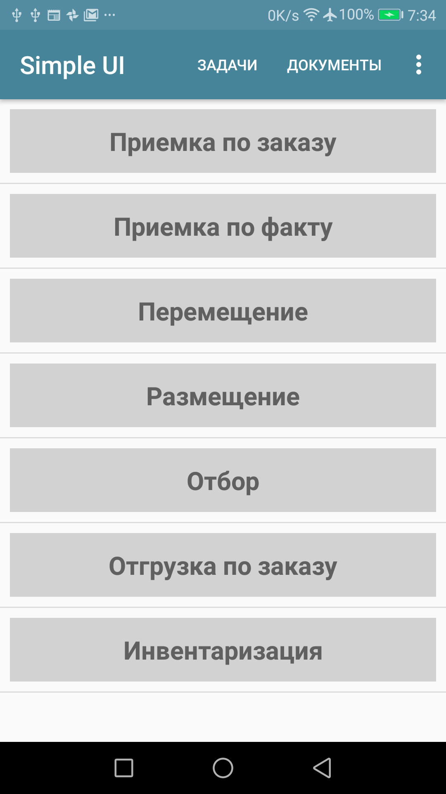
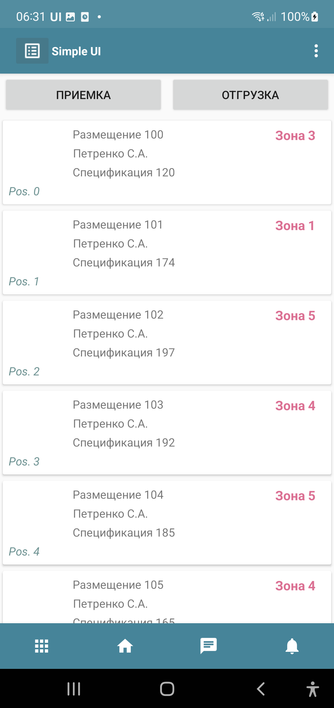
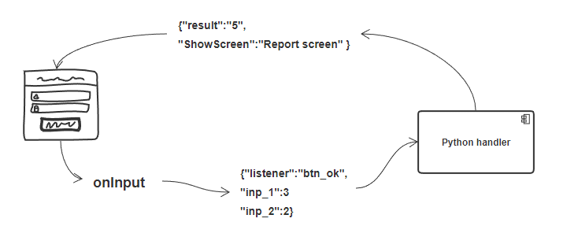
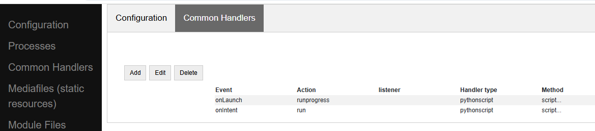
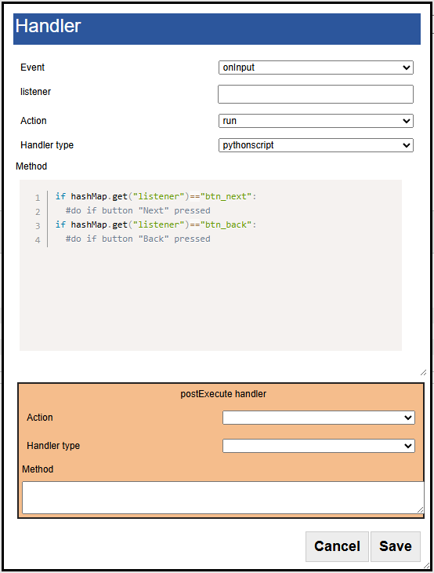
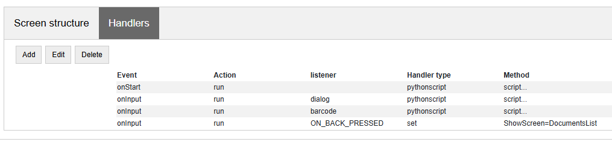
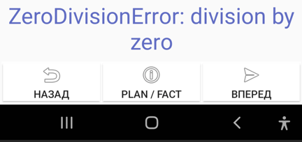
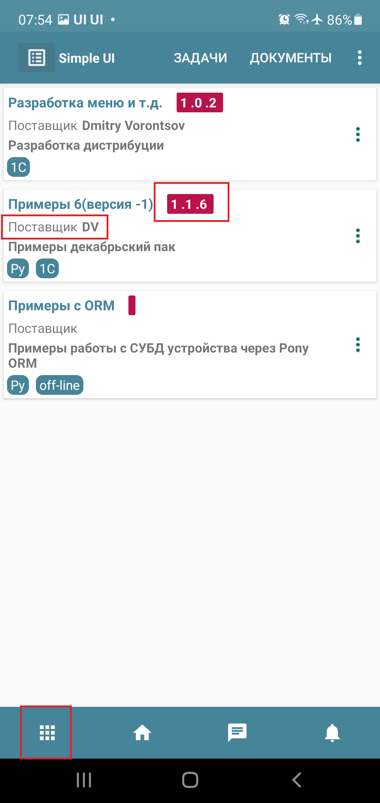
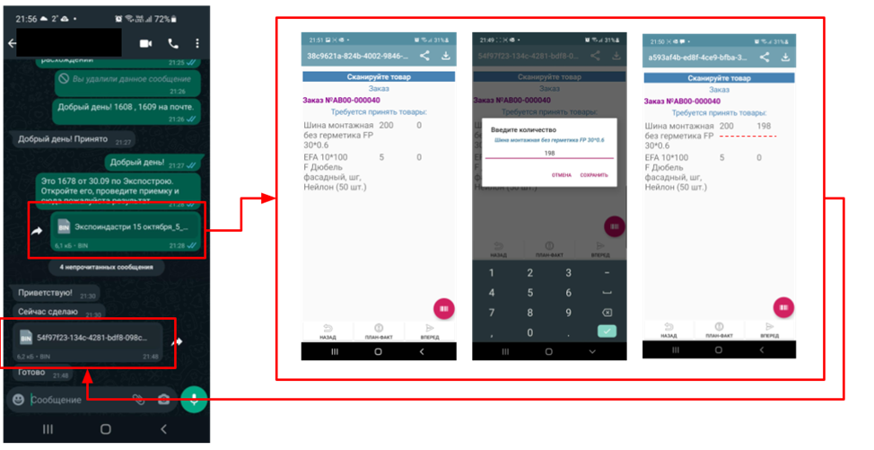
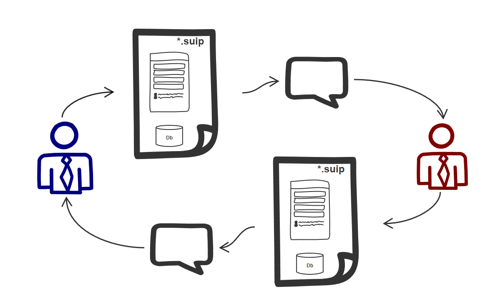

.. SimpleUI documentation master file, created by
   sphinx-quickstart on Sat May 16 14:23:51 2020.
   You can adapt this file completely to your liking, but it should at least
   contain the root `toctree` directive.

Architecture of application solutions
========================================

Application solutions in SimpleUI, referred to as *configurations*, are JSON objects of a specific structure that describe visual forms and application logic. Typically, these are JSON files (with the .ui extension), but broadly speaking, a configuration can be any JSON structure string. It can be transferred to the device as a file (literally opened by the SimpleUI application) or as a string (eg, from a variable in a handler or via a request).

The application interprets the configuration: it creates screens and other interface elements, executes event handlers using various interpreters (local and in external systems).

SimpleUI configurations are very compact, which means deployment and updates rarely take more than 0.5 seconds. The same applies to loading the application solution. Due to this compactness, there is also a special type of configuration called *process files* (.suip), which combine the configuration and data in a single file, similar to an Excel file with macros.

A SimpleUI application solution typically consists of a set of processes with screens containing fields and controls. Elements (and other events on screens or outside them) generate various events. These events are handled by handlers written in Python or other languages, and data from forms or events is passed to handlers through a variable stack. This section covers the composition of a configuration and how data and handlers are structured.

What Objects Are Included in the Configuration?
------------------------------------------------

Processes
~~~~~~~~~~

Configurations consist of **processes**. Usually, a process represents a business process, but this is not mandatory—a process can also serve auxiliary or other roles. A process has a name, which can be used to reference it in code.

A process consists of one or more **screens** and essentially acts as a container for screens. It can be called from the menu (when a process starts, the first screen is always launched). The process itself has no additional logic—all logic is concentrated in the screens.

By default, processes added to the configuration are displayed in the process menu when the configuration is launched, unless the menu is overridden. To hide a process from this menu, you can check the "Do not show in menu" option.

You can also specify that a process should launch at startup (eg, for login).

The "Back" button can be disabled for a process to override its default behavior (when the Back button is pressed, the process screen will not close and return to the main menu; instead, an ON_BACK_PRESSED event will be generated and handled by the developer).

Additionally, a process can be a standalone file-process (check the SUIP option). This is covered in the chapter *Standalone Processes*.

Background Service
~~~~~~~~~~~~~~~~~~~

.. note:: The background service is not the only mechanism for background and asynchronous work. It is just one of several in SimpleUI. See *Background Work*.

When the application starts, a service for background tasks is launched and remains active. It has no visual functionality but can still be a source of events. The background service handles the following by default:

 * Reading barcodes via Bluetooth scanners
 * Subscribing to intents from external applications
 * WebSocket client
 * SimpleBus client
 * Background speech recognition (outside running processes)
 * Other handlers if control is passed to the background service via the `BackgroundCommand` (you can delegate handler execution to the background service; this differs from asynchronous execution—from the system's perspective, processing on the background service remains resident indefinitely. To delegate, send a `BackgroundCommand` with any string parameter (treated as a command), which will trigger the general event `onBackgroundCommand`).

Process Menu and Options Menu
~~~~~~~~~~~~~~~~~~~~~~~~~~~~~~

By default, the process menu is automatically populated with all processes (except those marked with "Do not show in menu"). Processes are launched from this menu, and upon completion, the user returns to it.

The process menu can also be considered an object of the application solution because, beyond simply launching processes, it can be overridden as a standalone object. Essentially, this would function like a screen with its own logic but with somewhat limited functionality. Launching processes (from buttons, list items, etc.) would need to be manually scripted using `StartProcess` commands.

Under *Configuration > Initial Screen*, you can set the menu type to "Process" and select a process (specified in the "Menu Process" field) to display as the menu when the configuration is launched (the screen to which all processes return). The first screen of the process is displayed.

.. note:: The menu does not support all the functionality available on a process screen. Features such as hardware interaction, on-screen keyboard input, etc., do not work. The functionality is roughly equivalent to a dialog window or a list of cards.

Events occurring on the screen (eg, button clicks, menu loading) are not handled in the process defined for the menu (which is only for rendering) but in the *General Handlers* `onInputMenu` and `onStartMenu`.

The options menu (top right) contains a set of standard items but can be overridden in the *Main Menu* tab:

 * If at least one item is selected on the *Main Menu* tab, the menu is considered overridden, and only the selected items will be displayed. This allows customization of the standard items.
 * Custom menu items can be added (*Custom menu item*), which must have a numeric ID and optionally display in the toolbar (can be set as an Awesome icon; see the *General Functions* section). When custom items are added, the background service triggers the general event `onBackgroundCommand` with `listener="menu_<menu item ID>"`.

Chat and Tasks
~~~~~~~~~~~~~~~

Description in progress.

Events and Handlers
------------------------

Form elements, external hardware (eg, barcode scanners), and other mechanisms (eg, timers) generate events. Events are handled by handlers either online (on the backend system side) or locally in the application. As a result of processing, variables are placed in the variable stack, which are displayed on screens, and commands control the application (switching screens, displaying lists, playing sounds, voice output, etc.).

.. note:: To understand handler logic and which variables are placed in specific events, you can use the debugging mode via the bus (see the *Debugging* section).

For each event, you can subscribe:

- Any number of any handlers. For example, you could execute Python, then online, then Python again.
- Each event in the array can, upon completion (`postExecute`), assign its own array of handlers.
- If multiple handlers are defined for an event in the array, they are called in the order they appear in the array.
- Asynchronous handlers will also be launched one after another, but their completion order depends on the duration of each handler.

Thus, you can implement an endless chain of parallel and sequential handlers tied to an event.

Event handlers are specified as an array of handlers—either in the constructor or in code. In both cases, the architecture is the same—a JSON array of objects. The array binds (or subscriptions) handlers to events.

Handlers are defined in the screen (under the screen key `Handlers`).

There are general system handlers (outside screens) (under the configuration key `CommonHandlers`).

.. image::_static/2025_arch_4.png
       :scale: 70%
       :align: center

Additionally, an array of handlers can be launched in code (using the `RunEvent` command).

.. code-block:: Python

 handlers = [{"action": "run", "type": "python", "method": "button_1_handler"}]   
 
 hashMap.put("RunEvent",json.dumps(handlers))       
 
 # or the same
 RunEvent(json_to_str(handlers))

Structure of the Handler Array
~~~~~~~~~~~~~~~~~~~~~~~~~~~~~~~

An example array of one simple synchronous handler in string form:

.. code-block:: JSON

 [{"action": "run", "type": "python", "method": "post_online"}]

In general, the syntax consists of the following elements:

.. code-block:: JSON

 [
              {
                  "event": <event type filter>,
                 "action": <execution type>,
                 "listener": <event name filter>,
                 "type": <handler type>,
                 "method": <method name/method text>,
                "postExecute": <array of completion handlers>,
                 "alias": <handler string alias>
              }
 ]

Where:

**event (<event type filter>)**. The event type.

For screens, `event` can be:

 * **onStart** – event when the screen starts.
 * **onPostStart** – event after the screen starts and all elements are rendered.
 * **onInput** – input event on the screen.

For General Handlers:

 * **onLaunch** – triggered at startup before the main menu is formed. Since it is called before the menu is formed, this handler can, for example, redraw the menu or populate tiles. Essentially, it replaces a timer with a period of -1, which can also be used for this purpose.
 * **onLaunchMenu** – event triggered after the application is fully loaded at startup.
 * **onIntentBarcode** – receiving a barcode via an Intent subscription at the platform level (before the screen). For example, it can be used to work with a scanner without screens or to pre-check barcodes. The following variables are placed: ``listener="barcode"``, ``barcode=<barcode>``.
 * **onBluetoothBarcode** – receiving a barcode from a connected Bluetooth scanner at the platform level. The following variables are placed: ``listener="barcode"``, ``barcode=<barcode>``.
 * **onBackgroundCommand** – receiving the `onBackgroundCommand` event in the event service, sent from some handler (via the `BackgroundCommand` variable). The `listener` contains the argument of the ``BackgroundCommand``.
 * **onRecognitionListenerResult** – events based on speech recognition results after using the `voice` command in the service. The following variables are placed: ``listener="voice_success"``, ``voice_result=<recognized phrase>``.
 * **onIntent** – receiving a message from another Android application (Intent subscription). The "body" field is extracted from the message and placed in a variable. This can be used to transfer data from another application.
 * **onWebServiceSyncCommand** – receiving a command via the application's built-in web server. A GET or POST request (if data needs to be transferred, use POST) can be sent to the web service address ``<device address>:8095`` in the format ``http://<device address>:8095?mode=SyncCommand&listener=<arbitrary handler name>``. At this point, this event is triggered. The handler can place something in the variables, and all variables are sent back as a JSON object. However, you can also override the response (eg, make it a string instead of JSON) using the `WSResponse` command.
 * **onSQLDataChange** and **onError** occur when any record is written to SQL if the query goes through the SQL provider (`onError` in case of an error). This allows, for example, intercepting written data centrally and placing it in a send queue.
 * **onOpenFile** – event where you can receive a file opened by the application. You can share a text file with the application in any way (via *Share...* or *Open with...*), even if the application is not open. The handler is triggered, and the file content and file link are placed in the **content** and **extra_text** variables.
 * **onHandlerError** – any run-time error can be intercepted in the general event **onHandlerError**, and the error message is written to the **HandlerErrorMessage** variable. You can then write your own handler for this error.
 * **onProcessClose** – when any process is closed, the **onProcessClose** event is triggered, and the name of the closed process is placed in the **_closed_process** variable.
 * **onCloseApp** – application closing event.
 * **WSIncomeMessage** – incoming WebSocket message event.
 * **onDirectWIFIMessage** – receiving a DirectWIFI message.
 * **onSimpleBusMessage**, **onSimpleBusResponse**, **onSimpleBusMessageDownload**, **onSimpleBusError**, **onSimpleBusConfirmation** – SimpleBus events described in the **SimpleBus** section.
 * **onNFC** – event for recognizing a specific NFC tag by the application (not the screen); see the **NFC** section.
 * **onInputMenu** – input event for the overridden configuration menu.
 * **onStartMenu** – startup event for the overridden configuration menu.
 * **onPelicanInitAction** – the variables **PelicanInitDatabase** and **PelicanInitAction** are available—an event for each database in the initialization list and for each step. For example, you can display notifications about this.
- **onPelicanInitialized** – event when the entire initialization is completed.
- **onPelicanInitError** – error during initialization.

**listener (<event name filter>)** (optional) – input events on the screen and some general events are further divided by event name (essentially, the source), which is specified in the variable stack in the `listener` variable. In some cases, the developer can set it themselves—for example, you can call a modal dialog and specify a `listener` that will be in the input event upon completion. You can omit the `listener` filter, in which case the handler in this line will catch all events of this type with different `listener` values. In this case, the logic for switching between event sources is inside the handler.

If you specify a **listener**, only the desired event source will be caught. Usually, it is better to specify the `listener`—this makes the configuration more readable.

**action (<execution type>)** – specifies how the handler should be executed:

 * **run** – synchronous execution.
 * **runasync** (asynchronous execution) – the handler runs in the background without blocking the main UI thread.
 * **runprogress** – execution with a progress indicator; the screen is overlayed with a spinning indicator for long processes, and the interface is locked from user actions.

For handlers expected to execute quickly, use `run`. For long-running processes (eg, a large request to an external system), it is better to use either `runasync` or `runprogress`; otherwise, Android will perceive this as an application freeze and generate an ANR error.

**type (<handler type>)** – the type of event handler being executed.

The following types are available:

 * **online** or **onlinews** – the handler is executed as part of a synchronous HTTP request (`online`) or via the WebSocket bus (`onlinews`) on the external system side. For details, see the **Communication** section.
 * **pythonscript** – a Python event handler packaged in the handler array string as a base64 string. It can be edited directly in the constructor. For details, see the **Python Handlers** section.
 * **python**, **pythonbytes**, **pythonargs** – Python event handlers called by function name, where the functions are located in an included file. These are included during configuration compilation as external ``.py`` files and packaged as base64 strings under the configuration key ``PyHandlers``. For details, see the *Python Handlers* section.
 * **js** – JavaScript script interpreter. For details, see the *JavaScript Handlers* section.
 * **set** – a handler for writing variables and command-variables to the variable stack. It is used alongside other handlers because it is the fastest in all respects. Additionally, this is a "native" method—it will always be executed (Python, for example, will only execute if the application is resident in memory). It can contain one or more expressions for setting variables in the variable stack, separated by ";". You can write a variable without a parameter. For example, ``"beep"`` will place and execute the `beep` command without a parameter in the variable stack, while ``beep=65`` will place the ``beep`` command with the parameter ``"65"``. A command can also retrieve a variable from the stack using **@**. For example, ``ShowScreen=@current_screen``.
 * **pelican** – executing a batch request to the Pelican DBMS. For details, see the <> section.

**method (<method>)** – for `python`, `pythonargs`, `pythonbytes`, this is the function name; for `js` and `pythonscript`, this is the base64-encoded function text (encoded by the constructor); for `set` and `pelican`, this is the method text in explicit form.

**postExecute** (optional) – a JSON string (ie, a serialized JSON array) with an array of handlers (following the structure described above). This is primarily relevant for `runasync` handlers if you need to track their completion and execute something at the end (eg, refresh the screen). It is also used for `runprogress` because, although it creates the impression of a synchronously executed task for the user, internally it is an asynchronous task.

For example, launching an asynchronous handler when the screen opens, and upon completion, updating the screen in another handler:

.. code-block:: JSON

 [{"event": "onStart",
   "action": "runasync",
   "listener": "",
   "type": "python",
   "method": "start_screen",
   "postExecute": "[{\"action\": \"run\", \"type\": \"set\", \"method\": \"RefreshScreen\"}]"
 }]

**alias** (optional) – the name of the handler string for reference from other tools. For example, a timer can call a handler from the *General Handlers* by specifying the `alias` in both places.

Manual Launch Handlers
~~~~~~~~~~~~~~~~~~~~~~~~~~~~~

You can launch an arbitrary array of handlers for execution via the variable stack using the **RunEvent** command, where the parameter is a JSON string with the packed array of handlers.

.. code-block:: Python

 hashMap.put("RunEvent",json_to_str([{"action": "run", "type": "set", "method": "beep"}]))

A similar command exists in the `android` module (automatically included in `pythonscript`, so `RunEvent` can be specified without importing). Unlike variable-commands, which are executed when the handler completes (the stack is read at the end of the handler), procedures from imported modules are executed directly and synchronously.

.. code-block:: Python

 RunEvent(json_to_str([{"action": "run", "type": "set", "method": "beep"}]))

In **pythonscript**, you can create handler arrays not only by serializing lists and dictionaries but also using the `make_handler` function. For example:

.. code-block:: Python

 def run_after():
      toast("I'm here")
 
 def long_routine():
      import time
      time.sleep(1)
      beep()		
 
 handlers_after = [make_handler("run","pythonscript",get_body(run_after),"")]	
 handlers = [make_handler("runasync","pythonscript",get_body(long_routine),json_to_str(handlers_after))]
 		
 RunEvent(json_to_str(handlers))
 RunEvent(json_to_str(handlers))

Interrupting the Handler Array
~~~~~~~~~~~~~~~~~~~~~~~~~~~~~~~~~

If multiple handlers (eg, synchronous ones) are arranged one after another for the same event and executed sequentially, you can use the **BreakHandlers** command to interrupt the handler traversal from another handler (eg, if there are handlers A, B, and C, placing `BreakHandlers` in handler A will prevent B and C from executing). There is also the **BreakHandlersIfError** command, which interrupts execution in case of an error.

Error
~~~~~~~~~

If a run-time error occurs during execution, the error message is written to the `ErrorMessage` variable in the stack. It is displayed at the bottom of the screen, and further execution is stopped. The developer can also trigger an error themselves. This can be done in the corresponding development environment, for example:

.. code-block:: Python

 raise ValueError('A very specific bad thing happened.')

Alternatively, you can simply assign a string value to **ErrorMessage**.

Additionally, when assigning a value to **ErrorMessage**, you can use HTML markup, as with other labels. You can also use the additional key **_ErrorMessage** to format the error (in conjunction with `ErrorMessage`). For example: `_ErrorMessage="Execution error: %s"`, `ErrorMessage="Division by zero"`. The result will be: `="Execution error: Division by zero"`.

Variables. Variable Stack.
-------------------------------

Variables can exist in handler modules or shared modules, but this section focuses on system variables used by mechanisms such as screens, events, etc. These variables reside in the variable stack.

If you place a label on a screen with the value `@label`, the screen will read the `label` variable from the variable stack when rendering. If the variable does not exist, the label will be empty. If the `onStart` handler places a value in the `label` variable, such as "Hello world", it will be displayed. This is how the variable stack interacts with screens. To extract a variable on screens, you need to prefix the variable name with **@**.

Another example: When scanning a barcode with a scanner, an input event is generated. In the handler, you can retrieve the `barcode` variable from the variable stack, which contains the scanned barcode value.

Another example: If you place the variable `"speak"` with the value `"Hello world"` in the variable stack, the device will speak the phrase. This is an example of a *command-variable*—a variable that the system interprets as a command with or without a parameter. Almost all command-variables are removed from the stack after execution. That is, the handler executes, the system reads the stack, finds the command, executes it, and removes it from the stack. However, there are exceptions where commands act as flags. Command-variables are described in the relevant sections and in the *Reference for All Command-Variables* section.

The variable stack is a conceptual entity; it will appear differently in different handlers. However, it has common properties:

 * It is a collection with unique keys (like a dictionary in Python).
 * It is a collection with purely string values.

In online handlers, it is a block of the request body as a JSON object. However, in specific implementations, such as in 1C, the developer might work with a structure like *Variables* (which is later packaged into JSON when sending the response) and write, for example:

.. code-block:: Python

 Variables.Insert("ShowScreen", "Screen 2 standard buttons");

In Python handlers, it is the **hashMap** variable, which is a Java HashMap object with methods:
 * **put(key, value)** – place a variable.
 * **get(key)** – retrieve a variable.
 * **remove(key)** – delete a variable.
 * **containsKey(key)** – check if a key exists in the collection.

For all Python handlers, writing variables and command-variables would look like this:

.. code-block:: Python

 hashMap.put("ShowScreen", "Screen 2 standard buttons")

In JavaScript handlers, it is the predefined `data` list:

.. code-block:: JavaScript

 data["ShowScreen"] = "Screen 2 standard buttons"

.. note:: There are commands without parameters, such as `FinishProcess`, or flags. When calling such commands, you still need to write an empty string (not `null`) to the stack. For example, ``hashMap.put("FinishProcess", "")``.

In addition to variables and commands placed in the stack by the developer, there is a list of variables placed in the stack by the system itself. Current variables include:

 * **ANDROID_ID** – device ID.
 * **DEVICE_LOCALE** – device language.
 * **USER_LOCALE** – language set in the system.
 * **BUS_ID, BUS_PASSWORD, BUS_URL, BUS_URL_HTTP, BUS_TOKEN** – SimpleBus settings.
 * **_configurationVersion** – configuration version number.
 * **_configurationUID** – configuration ID.

Various events and commands can also place their own variables in the stack based on execution results. This is described in the documentation for the respective commands.

Execution Context
~~~~~~~~~~~~~~~~~~~~~

In reality, there are multiple variable stacks. The main one is the process stack, which is active when a process screen is open. The stack exists as long as the process exists. If nothing is open (eg, a process is running in the background), the variable stack is the background service stack. The logic for selecting the stack is automatic. For example, when you write something like `hashMap.put()` in a handler, the system automatically chooses which stack to write to based on the execution context and logic.

However, the `android` module includes several functions for direct stack management:

 * **put_process_hashMap(key, value)**
 * **remove_process_hashMap(key)**
 * **put_service_hashMap(key, value)**
 * **remove_service_hashMap(key)**

Global Variables
~~~~~~~~~~~~~~~~~~~~~

Global variables allow for a shared variable stack between processes. For example, a variable can be written in one process and read in another, or in the same process upon reopening. They exist as long as the application is running. You work with them the same way, but the variable name must start with "_", such as "_var1", "_var2". You reference them by the same name. When accessing them through a screen, it would be "@_var1", "@_var2". That is, if the program sees that a variable name starts with an underscore, it simply places it in a separate variable stack.

Slices
~~~~~~~~~~~~~~

The `pythonscript` handler includes "slices." These are essentially an alternative to the variable stack, where data is passed to/from the handler as a regular Python dictionary, and fields are not limited to strings but can be basic types. The system analyzes input fields and writes them to the dictionary as JSON strings, integers, floats, booleans, or dates. This allows the developer to immediately access a dictionary with proper types without needing to extract it from the variable stack and convert types.

For example, the result is returned in a slice like this:

.. code-block:: JSON

 {"age":28, "name":"John", "employed":true}

Since much of the interaction in SimpleUI occurs via JSON (dictionaries), this mechanism significantly saves time. For example, dictionaries are used in the offline DBMS Pelican/SimpleBase, online MongoDB, the SimpleBus bus, various services, etc.

To have a field write to a slice, check the "Write to slice" option. To read a field from a slice on the screen, use the prefix "#" (analogous to the "@" prefix for reading from the variable stack). The slices themselves are available in the variables `process_slice` (a slice that exists throughout the entire process) and `screen_slice` (a screen slice).

Configuration and Repository
--------------------------------

A configuration is a JSON file with the `.ui` extension of a specific format (described in the <> section). A configuration is active if it is currently open in the application (its hosting settings are configured, and if necessary, settings for online handlers are specified). If it is open, all designated background processes are executed.

You can open a configuration in several ways:

- Configure the settings in the settings menu and restart the application (or select *Update Configurations* in the options menu). This can also be done manually, but it is typically done via a QR code or a settings text file. Settings include: *Separate designer and handler mode*, *Custom authorization*, *Configuration URL*. Regarding hosting, this can be any REST service that returns the configuration JSON string upon request (which you specify in the settings). The request format `get_conf_text` can be viewed as a sample in the designer source code. This is the primary method—if you use the designer, you have already configured the configuration on the device this way.
- You can save the configuration as a `.ui` file and open it on the device using the application (specifically via *Open*, not *Share*). The configuration will open and work, but there will be no hosting settings.
- You can host the configuration via GitHub (additionally, specify the *GitHub Format* and, if necessary, the *Authorization Header*. You can also specify a URL for commits). Settings can be viewed here: https://infostart.ru/1c/articles/1597030/.
- The configuration can be loaded from the repository if it is installed there.

Configuration Repository
~~~~~~~~~~~~~~~~~~~~~~~~

There is a mechanism that allows storing, updating configurations, quickly switching between them, and executing their background tasks. Each configuration can have a *Provider*, and the provider can have its own hosting (URL) where updates are published. Thus, a configuration can be "installed" in the repository, where it is always available locally without a server connection.

It can have an executable background part (eg, delivering messages to a specific configuration). For example, if the application is connected to the SimpleBus bus and a message with the UID of a configuration that is currently inactive but present in the repository arrives in the bus, the `onSimpleBusMessage` event will be triggered for that configuration, and the corresponding handler will execute—even though the configuration is inactive. For details on message delivery, see the *SimpleBus* section.

When updates are released, they will be checked for each configuration when the application starts (and when *Update Configurations* is pressed) if the provider publishes them at their URL (and the configuration in the repository has this URL specified).

You can manually add a configuration to the repository—click the paperclip icon in the toolbar. You can remove it from the repository (via the context menu). An already installed configuration in the repository is updated when the configuration version is updated in the loaded configuration. For example, if you have version 0.0.1 in the repository and want to update it, set the version number to 0.0.2 in your configuration and open it in any way—the configuration will update.

You can also install and update the active configuration from code by applying the variable-commands (without parameters) **InstallConfiguration** and **UpdateConfiguration** from the active configuration.

Standalone Process Files (SUIP Files)
----------------------------------------

One of SimpleUI's features is that configurations are very small and lightweight. This opens up unique possibilities. One such possibility is the ability to extract any process as a standalone file (a mini-configuration) that immediately contains the data for that process—an autonomous configuration with storage inside itself.

For example, you can send the contents of an invoice along with the process as a `.suip` file to a third-party counterparty in any way, such as via email. They can open it on their device (the SimpleUI application opens SUIP files) just as if they had your corporate configuration, and they can work with it without connecting to your resources: the necessary data is taken from the file, and the results of their work are immediately written back to the file, which can be sent back for processing.

**No settings, no connection to your resources—just the installed application and the file.**

Using existing storage and delivery infrastructure is the main convenience of this architecture. For example, you can use messengers or email, where, in addition to the SUIP file itself, explanations about the process and feedback can be provided in any form.

Files can be transferred in various ways—via the Internet or, for example, via Bluetooth, without needing to expose the main system's web service externally.

For example, you can send an electronic packing list and a SUIP file for acceptance verification to an external buyer, who can open it on their phone or handheld device, scan it, and send it back.

Articles about SUIP: https://infostart.ru/1c/articles/1542393/ and https://infostart.ru/1c/tools/1875406/.

You can create a SUIP file by **assembling a JSON according to a specific format**:

.. code-block:: JSON

 {
 "SimpleUIProcess": {
 "type": "Process",
 "SC": true
  /*then the contents of the process: screens, handlers, settings*/
 },
 "data": {
 /*any data*/
 },
 "PyHandlers": base64 text of python handlers
 }

It is assumed that such files are exported from the accounting system and sent to the device in some way. After processing, they are uploaded back to analyze the `data` section.

**The second way to create a SUIP file** is to create it directly in the application. If a process has the **Standalone Process** option checked (``SC:true``), then when such a process is opened on the device, the **Download** and **Share** icons appear. Thus, the process can be exported to a file. During export, the current process is written. If you want to export another process from the current process, use the **OverrideProcessSUIP** command, with the parameter being the name of the process to write to the file. You can also write a SUIP file without a process (this would not be a SUIP file but simply a data file) using the **NoProcessSUIP** key (and also use **NoPyHandlersSUIP** to disable writing handlers).

In handlers, the data from the `data` section is accessible via the ``_data`` dictionary (in Python) or the ``_data`` variable in the variable stack. No additional actions are needed for ``_data``—it is automatically written to the file.

Additionally, the fields **last_update** and **last_update_millis**—the dates of the last file modification—are automatically added to the file.

Thus, after working with an open SUIP file and writing something to ``_data``, you only need to export it via saving and send it back to the sender.

The files sent to the device are stored somewhere on the device (they can be opened directly from communication applications, for example) and also, opened files are stored in the SimpleUI application (SimpleUI icon (top left), **Documents** section).
