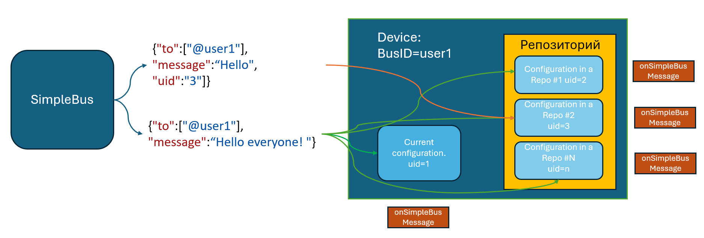
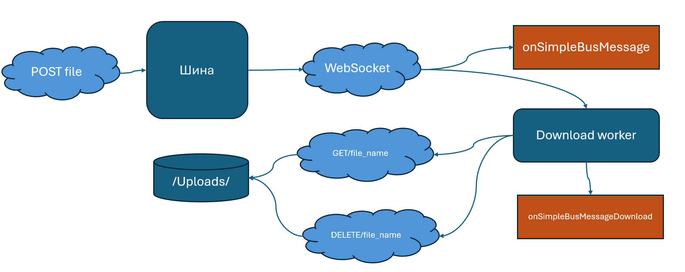
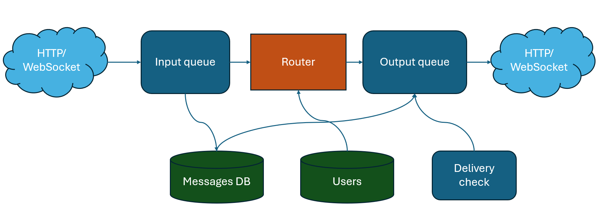
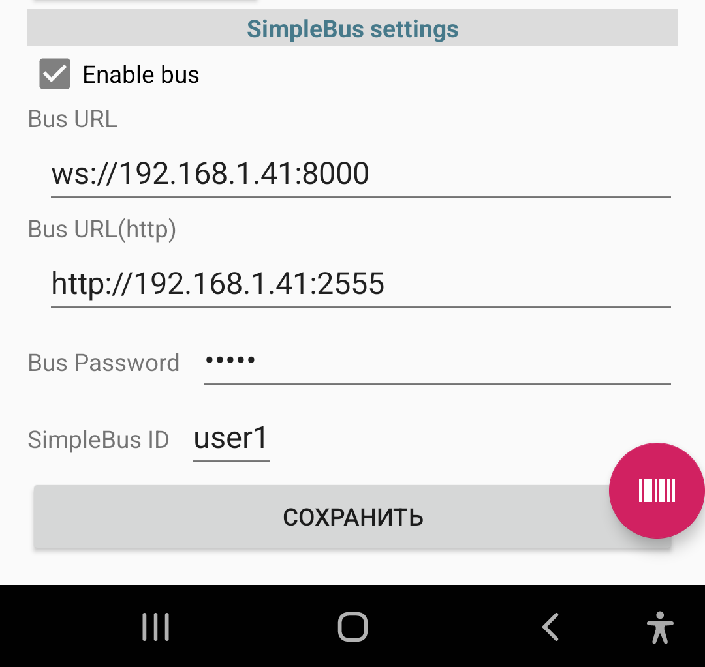

.. SimpleUI documentation master file, created by
   sphinx-quickstart on Sat May 16 14:23:51 2020.
   You can adapt this file completely to your liking, but it should at least
   contain the root `toctree` directive.

SimpleBus
==================

The bus is a simple python script that is launched on some external resource through which the exchange participants interact via WebSocket and HTTP.

The script implements the following operating scenarios:

1. Guaranteed messaging with routing, delivery control, storage of messages to one or more recipients

2. Direct p2p messaging without caching and control, for the fastest delivery of dense traffic

3. Guaranteed delivery of large files or just files with download resumption support, workers with a progress bar, independent of application activity
The specified scenarios replace push messages (and are even faster than push, but, admittedly, less energy-efficient, since they force you to keep the socket open) and cover the entire spectrum of needs without the need for any development: you can simply send notifications, you can send documents and orders, photos and some large arrays of data for initial filling, for example. That is, to work, it is enough to start the bus, create users and enter settings. After that, you can exchange information.

The advantages of this method of exchange:

1. The most important advantage is the ability to move the endpoint to the external Internet (for example, to an external VPS-Linux server) without moving the backend there and thus connect both clients (without direct IP addresses) and the backend into one network, without exposing the latter to external threats

2. Written in Python, can be further developed, for example, to create intermediate layer logic, such as intermediate storage in a DBMS,

3. Unloading the backend from large traffic of requests, from receiving files, etc.

Links
--------------

GitHub, where to get the script: https://github.com/dvdocumentation/simplebus

How does this work?
-------------------------

Normal mode
~~~~~~~~~~~~~~~~~~~~~

The main mode is the usual sending of JSON messages. The input to the bus can be either an HTTP request/WebSocket request (from the backend system, for example) or a command to send via WebSocket from the client. The JSON specifies the recipients or subscriptions to which the message is addressed and the message itself. After that, the message is delivered via the bus and a delivery event occurs in the client. If the client is an HTTP server, the bus sends a request to it. The client sends a confirmation, after which the delivery is considered complete.

Simple clients receive an event containing the message: **onSimpleBusMessage**, **onSimpleBusMessageDownload**

Technically it works like this:

 1. The message enters the bus via HTTP or WebSocket and is placed in the input queue

 2. The message is also placed in a stored dictionary (conditionally DB)

 3. The addressing-based router places a reference to the message in the output queue for each destination.

 4. There is also a task that analyzes delivery confirmations and if the message is not delivered (the recipient is not in touch), it re-delivers it to the required recipients

 5. Socket clients are pinged periodically to maintain communication

The message is a JSON object with mandatory fields **to** (more details in the addressing section) and **message**

You can specify _id explicitly in the message; if it is missing, the bus will add the _id key itself.

The bus also adds a **sender** field to the message – the sender of the message.

When a message is received, a general event **onSimpleBusMessage** occurs, the variable stack contains the variable **SBMessage**

To send in normal mode via HTTP request, you must either leave the Message-Type field blank or specify **queue**

HTTP request format:

	``POST <server url>:<port>/put in body:JSON message``

The request must use basic authorization - username and password (see the section "How to get started")

Simple Team:

**SendBus**, <message> - sends a message to the bus

For example:

.. code-block:: Python
 
 import json
 message = {"to":["@user2"],"message":"Hello Android"}
 hashMap.put("SendBus",json.dumps(message,ensure_ascii=False))

Accordingly, since the command is sent through the stack, it is also accessible from online mode.

Upon receiving the message, the client sends a confirmation to the bus (message with type=confirmation). Also, upon receiving delivery confirmation, the **onSimpleBusConfirmation** event occurs, and **SB_id** is placed on the variable stack - the ID of the message for which confirmation occurs. Each recipient (the sender field in the message) must send their confirmation.

Direct mode
~~~~~~~~~~~~~~~~~

Direct messaging can also be established between two devices, where there will be no guaranteed delivery or caching, but there will be the fastest delivery speed. The bus in this case acts as a message mirror. In order to send a message directly, you need to specify the **direct:true** key in the message or specify **direct** in the Message-Type

File delivery.
~~~~~~~~~~~~~~~~~~~~~~~

If you need to transfer pictures, videos or just a large JSON, for example, it is better to do this not through JSON but through a regular HTTP request with an attached file. The files are cached on the server (on the disk) until they are delivered to the recipient. And WebSocket performs the function of instant notification of the client.

The algorithm works as follows:

1. A POST request is sent to the same address and endpoint as usual, but with form-data attachment of one or more files. An example of a request in Python is in the release examples. The file names are specified as the form in which the files should be displayed and saved when downloaded to the device.

2. Upon receiving the request, the script bus notifies the recipient clients and places the files for them
 
3. After receiving a notification, clients start downloading the file (**onSimpleBusMessage** occurs when a message is received) It is launched as a worker, independent of rebooting the device with a progress bar
 
4. When the download is complete, the client sends a confirmation of receipt and the file is deleted, and the **onSimpleBusMessageDownload** event occurs on the client, and the variable stack contains the path to the downloaded file in the **DownloadedFile** variable.

Addressing to devices and within the SimpleUI application
----------------------------------------------------------

Addressing to mobile devices consists of at least an address to the bus user (the device in whose settings the Bus ID and password are defined), and may also include a subscription to specific configurations that must be active or in the device repository to process the message. There may also be addressing to a specific recipient within the configuration. Currently, **recipient:feed** is available, which means sending the feed command to the recipient - the Pelicane DBMS inside the client, which, based on the result of its work, sends a message about the result (More details in the chapter Direct communication with configuration mechanisms)

Addressing to the device is specified in the **to** field. Possible options:

 * Specific recipients – array of usernames via dog. For example [“@user1”, “@user2”]. In this case, the message will simply be delivered to the users directly
 * An array of subscription tags separated by #. The message will be delivered to those users who are subscribed to the tags (more details in the Getting Started section). For example [“orders”]
 * Tag $all – all users

Addressing to a specific configuration can be set in the uid:<configuration uid> field or as an array uid:[<configuration uid 1>,<configuration uid 2>]

If uid is not set, the message will be passed to the current configuration (which is currently running) and then to all configurations in the repo. If uid is set, then the configurations to which the message needs to be passed will be selected in the same order. In this way, the platform tries to find the recipient configurations and pass them the message, if it is found, then the onSimpleBusMessage event occurs and a confirmation is sent. A situation is possible when the client is online, but the message is passed with uid and the device does not have a configuration with this uid installed. Then the message will not be delivered.

How to start working?
--------------------------

1. You need to download and run the script simple_bus.py

2. You need to go to the browser at the address of the machine on which the script is installed (``http:\\<machine address>:2555``) click Register and create the first user

3. Then users can be added with a post request put_users to the same address.

For example:

.. code-block:: JSON

 [{"_id":"user2", "password":"12345"},{"_id":"user1", "password":"12345"}]

Users can be updated later with the same request. For example, you can add tags:

.. code-block:: JSON

 [{"_id":"user2", "password":"12345","tags":["orders"]}]

If the user is not SimpleUI and uses HTTP (for example 1C), then to send a message to it, the bus must know where to send the request and how to authorize. Therefore, such a user must have an object in JSON connection_properties that must contain:

An authorization object with fields type:basic , user and password

That is, for example

.. code-block:: JSON

 [{"_id":"user1c", "password":"12345","tags":["orders"],"connection_properties":{"authorization":{"type":"basic","user":"usr","password":""}}}]

4. In the client settings, enter the connection settings manually or via a file or QR settings. Please note that you must specify both the WebSocket address and the HTTP server address.

Settings keys for automated settings installation (via settings file or commend):

 * BusURL
 * BusURLHttp
 * BusID
 * BusPassword
