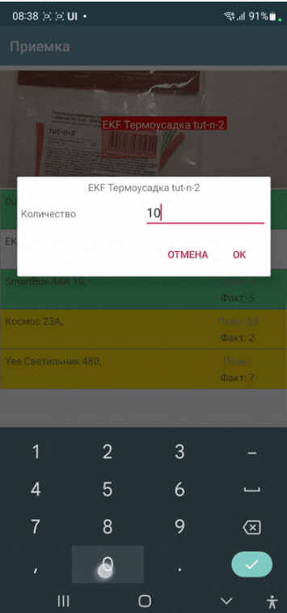
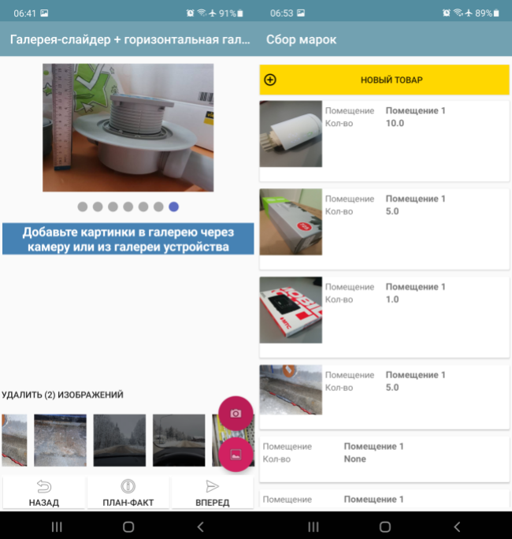
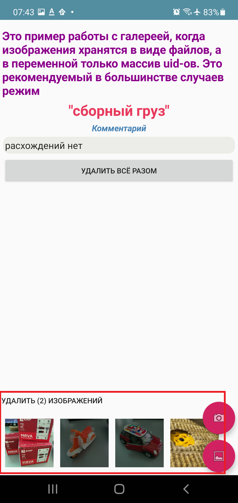
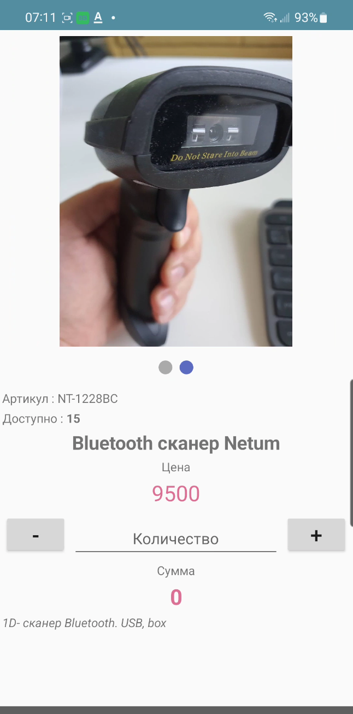
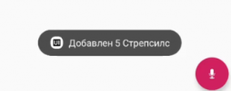
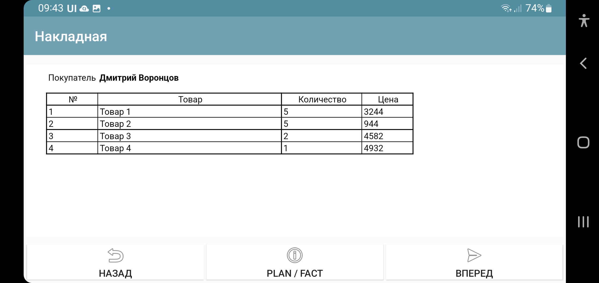

.. SimpleUI documentation master file, created by
   sphinx-quickstart on Sat May 16 14:23:51 2020.
   You can adapt this file completely to your liking, but it should at least
   contain the root `toctree` directive.

General platform functions
========================

Dialogues
---------------

A modal dialog in the visual style of standard dialogs and with the ability to redefine buttons and the title. For this, the **ShowDialog** command is used. You can place your own input elements on it. To call and customize the dialog, you will need one or more commands:

* **ShowDialog**, <dialog text> - Mandatory command to actually launch the dialog. If you do not specify other commands, the dialog will simply be a question (dialog title) with Yes/No buttons
* **ShowDialogLayout**, <container JSON structure/link to container> - defines the contents of the dialog window, in case it is necessary to redefine it (add your own elements). Used together with the ShowDialog command. It is better to specify a link to the container in the Containers section as a parameter through ^ (similar to, for example, setRootLayout or a container in the list), but you can also specify just a JSON string of the container.
* **ShowDialogStyle**, ``{"title":"<title>","yes":"<Yes button>","no":"<No button>"}`` defines the buttons and the title
* **ShowDialogListener**, <event name> – defines the event name (listener) when the dialog is triggered
* **ShowDialogSilent**, without parameter – the dialog does not trigger screen redraw events (and onStart/onPostStart)

The dialog returns the events **onResultPositive** and **onResultNegative** depending on what the user has selected. The event is returned to the stack variable action. listener can be defined with the command **ShowDialogListener**

Example:

.. code-block:: Python

 hashMap.put("ShowDialog","")
 hashMap.put("ShowDialogStyle",json.dumps({"title": "Adding a record", "yes": "Save", "no": "Cancel" }))
 hashMap.put("ShowDialogLayout","^my_dialog")
 hashMap.put("ShowDialogListener","dialog_result")

Working with images
--------------------------------

Images in interface elements can be placed in the form of:

 * Links to a file (Value specifies ~<absolute path to the file>). For more information, see the Files section
 * Links to media resource (in Value ^<media resource key> is specified). For more details, see the Files section
 * Base64 strings

Base64 is not a very recommended method, since encoding/decoding is a resource-intensive operation. It is recommended, especially in lists, to use links to files (~/^)

A link to a media resource is icons and pictograms that can be attached to the configuration in the Media files section. It should be understood that they are present in the configuration in the form of the same base64, which is saved in temporary files at the time of loading the configuration. If there are a lot of such files or they are large, then it makes sense to implement in the application solution the loading of resources using a separate algorithm from your server or cloud storage and then access them through ~.

To enter an image use:

 * Screen Element Photo Camera
 * Screen Element Photo from Gallery
 * ActiveCV (PHOTO detector)

For Camera Photos and Gallery Photos, there is a flag variable **mm_local** that needs to be set before starting the camera, which switches the camera to the mode of saving images to files. When saving such files, a uuid is generated, by which it can be accessed. This uuid is equal to the file name. You can simply work with the file name, storing it in your data structures. For example, when photographing in mm_local mode, an absolute path with the prefix _path is saved to the camera variable (let's say the camera variable is called photo), that is, in this case, the variable will be photo_path.
If you don't use this flag, it will be saved in base64

Also, for these modes there are commands:

 * **mm_compression** – image compression in percent from 100 to 0
 * **mm_size** – size compression from the original resolution in percent from 100 to 0

For example:

.. code-block:: Python

 hashMap.put("mm_local","")
 hashMap.put("mm_size","50")
 hashMap.put("mm_compression","70")

Horizontal Media Gallery
~~~~~~~~~~~~~~~~~~~~~~~~~~~~~~~~~~~~~

The Horizontal Media Gallery control is both a visual and an active element that allows you to simplify working with images. It is designed to visualize a media array as thumbnails. The input variable is a JSON array of either file identifiers (in case of the mm_local flag) of the type ``["id1","id2"…]`` or a JSON array of the form ``[{"uid":”id1","base64": "image 1 data"},{"uid":"id2","base64":»image 2 data"}]``, that is, an array containing the data itself in base64 form. The array itself is formed when media is added from the camera or gallery, or deleted. That is, for operation, it is enough to place a gallery element and "Photo from camera" or "Photo from gallery" and specify any variable. When working with multimedia or deleting, input events with listener=variable name will occur, in which the variable with the array can be obtained in the handler and thus gain access to the files. To delete, you need to mark the thumbnails with a long tap.

Gallery Slider
~~~~~~~~~~~~~~~~~~~~

The Gallery Slider control is another visual element for displaying a set of images with the ability to scroll through (but unlike the Horizontal Gallery, there is no deletion). It occupies part of the screen at the top. You cannot place more than one, because it is not in a container. The same variable as the Horizontal Gallery is used as a data source, i.e. an array of uid links to images or an array with data.

Toast messages
--------------------------------

Command-variable **toast**,<message> - a pop-up notification at the bottom of the screen. The parameter is just the text of the message. Works in any context.

For example

.. code-block:: Python

 hashMap.put("toast", "Hello world!");

In python handlers, the toast(message) function of the android module is more convenient (it is already imported into pythonscript, so you can simply write toast("Hello world"))

.. code-block:: Python

 toast("Hello world")

Notifications
-----------------

Basic notifications
~~~~~~~~~~~~~~~~~~~~~~

The basic_notification command variable is a simple notification to the lock screen with a subject and text. Works from anywhere, including the background. You can send several at once, so a JSON array is sent as a parameter. Each notification can have its own number (if the number is not specified explicitly, it is assigned in order). You can update already displayed updates by number. For example, you can display the notification "Processing has started" with number 1, and then send another notification "Processing is complete" with number 1 and the OS will update the existing notification on the screen if the user has not swiped it yet, if it is not there, it will display a new one. Example of launching a notification:

``hashMap.put("basic_notification",json_to_str([{ "number":1, "title":"Information","message":"Hello world!"}]))``

Here in JSON the keys are **number**, **title** and **message** - the number, subject and text of the message itself

The analog of this command for basic notifications is the android module function for python **notification(text,title=None,number=None)**. The advantage of using functions instead of variable commands in python handlers is that the action is performed immediately, and not at the end of the handler, which is important for long procedures.
For example

.. code-block:: Python

 notification("Hello world!")

Cancel message
~~~~~~~~~~~~~~~~~~~~

**notification_cancel(number)** – function in android module (in python handlers) for removing notification from curtain. May not work in some cases (depends on system)

Notification with progress bar
~~~~~~~~~~~~~~~~~~~~~~~~~~~~~~~~~

**notification_progress(text,title,number,progress)** - function in the android module to display a notification with a progress bar in the curtain to show the progress of long tasks. Available only from python handlers, because it only makes sense when updating inside the handler. Text,title - text and subject of the message, number (mandatory, since it will be updated) - message number, progress - numeric value of progress from 0 to 100

Speech synthesis
----------------

You can play speech using the **speak** command variable, such as ``hashMap.put("speak","Hello, world!")``. This command works in both screen contexts and in the background Event Service context.

In python handlers, you can use the speak function of the android module (in pythonscript it is already imported and you can simply call speak("Hello world"))

.. code-block:: Python

 speak("Hello world")

Sound signal
-------------------

You can play a short sound signal - one of 100, embedded in Android, if you assign a value from 1 to 99 to the **beep** variable, or leave it empty - then there will be a default sound. This works both online and offline (by assigning variables). Example in the database. Sound examples are here: https://developer.android.com/reference/android/media/ToneGenerator#TONE_CDMA_ABBR_REORDER Online:

.. code-block:: Python

 hashMap.put("beep","")

In python handlers, you can use the beep function of the android module (in pythonscript it is already imported and you can simply call beep())

.. code-block:: Python

 beep()

Voice input
--------------------

You can run Google's installed speech recognition using the **listen** command variable or the listen() function (of the android module in python). Depending on the context of the call, the result will be returned either to the general events or to the screen
* If called from a screen (or the screen is open), then the event listener=**voice_success** will be generated in the screen (in case of an error "voice_error"), and the recognized text will be added to the variable **voice_result**
* If called in the background, the general onRecognitionListenerResult event will be called

PrintPreview, preparing layouts for printing
------------------------------------------------

This section somewhat repeats the section "HTML Field", because the same technologies are used in both.

Any printed forms (documents, invoices, labels) can be prepared offline as html layouts and filled in with a template engine in python. Further printing is carried out through the Android print manager.
This method with a demo example is described in the article https://infostart.ru/1c/articles/1716745/

To open a finished layout in a separate window in preview mode, print, use the command **PrintPreview,<html-string>**

Preparing PDF layouts on the external system side
~~~~~~~~~~~~~~~~~~~~~~~~~~~~~~~~~~~~~~~~~~~~~~~~~~~~~~

On a mobile device, printing of a PDF document generated on the server side is available. For example, this could be a printable form saved in 1C.

The principle of operation is as follows:

* The event handler (button or other event) on the device initiates a request to the /print_pdf service. Passing in this case a string of parameters that are needed to print the form. The developer himself forms this string and provides the parameters himself
* The command handler finds the required document or object, generates a printed form and saves it in PDF and sends it in the request response
* On the device side, the response is read, the PDF is extracted and sent to the print manager.

The print command is transmitted via the PrintService command variable. For example, like this. As a value, you need to pass a string of query parameters that will go to the server

``Variables.Insert("PrintService","operation=print&barcode="+Variables.barcode);``

Next, in the print_pdf command module, the parameters are extracted and based on this information, a response with a printed form is generated. Either print or view can be passed to operation - and this should also go in the response. Based on this parameter, either the print manager (if the parameter is print) or the PDF viewer (if the parameter is view) will open immediately.

.. note:: If print doesn't work, try view. It depends on the device and software.

Output layout data to png
~~~~~~~~~~~~~~~~~~~~~~~~~~~~~

In addition to preparing the layout as html, you can also save this html document as a png file for further printing without the print manager. This is done using the **PrintToBitmap** variable command together with PrintPreview. This command overrides the print button (which by default calls the print manager) so that the image is saved to a file (it is placed in PrintBitmapPath) and the event handler with listener=PrintBitmap is called. That is, by intercepting this handler, you can get the image from the file and continue working with it.

Work with a ready-made PDF or prepare online
~~~~~~~~~~~~~~~~~~~~~~~~~~~~~~~~~~~~~~~~~~~~~

If you need to print or preview a PDF file, you can use the command variables **PrintPDF**,<path to PDF> and **ViewPDF**,<path to PDF>, passing the path to the PDF file as a parameter.

Biometric verification screen and PIN code screen
--------------------------------------------------------

If the device supports a fingerprint sensor or face recognition, you can call a standard biometric data verification dialog. Moreover, you can do this at startup (in the onLaunch event), or you can simply launch it from the process.

Launch is performed by the ShowBiometric command, with the parameter - json string. In JSON fields: title - header, body - text, handlers - array of handlers for catching biometric events. The following events (listener) are possible:

 * BiometricAuthenticationSucceeded - the user has successfully passed verification
 * BiometricAuthenticationFailed - the check either passed but failed, or the user closed the authentication window
 * BiometricAuthenticationError - Error creating authentication object. Most likely, the function is not supported on the device. For more information, see BiometricError

Biometric verification can be called from a process using the **ShowBiometricProcess** command, the return and event will already be on your process.

Configuration with examples from the process here https://disk.yandex.ru/d/UmoMRPR9e2BaJA

PIN code screen
~~~~~~~~~~~~~~~~

You can display a PIN code dialog from a process or at system startup. The **ShowPIN** command with a parameter - a json string. The JSON fields are: title - header, **block_cancel** - prohibit closing the window (it will be impossible to refuse entering the PIN), handlers - an array of event handlers. The PIN code check and the system's reaction are completely determined by the developer based on the events and the entered PIN code. The PIN code in case of successful entry (successful means 4 characters were entered) is transmitted via the pin variable. Possible events:

 * pin_success - the user entered 4 characters, the pin variable was written
 * pin_cancel - the user closed the input window (if possible)

To launch the PIN entry screen from the process, you can run the command **ShowPINProcess** , after entering 4 digits of the PIN code, the pin event will be generated on the screen. That is, when you return from the PIN screen to the process, then you work with the process as usual.

Configuration with examples from the process here https://disk.yandex.ru/d/UmoMRPR9e2BaJA

Reading keys in the main menu
--------------------------------

For example, to launch processes from the keyboard in the main menu, you can organize reading of keys. Processing is implemented through the "Background service" and requires enabling the "Connect service" checkbox and writing a handler. Only keystrokes are registered. When pressed, a common event is generated in the onBackgroundCommand service (onKeyDown command) and then in the service you can read the _keyDown variable and thus place your logic (for example, launching a process)
