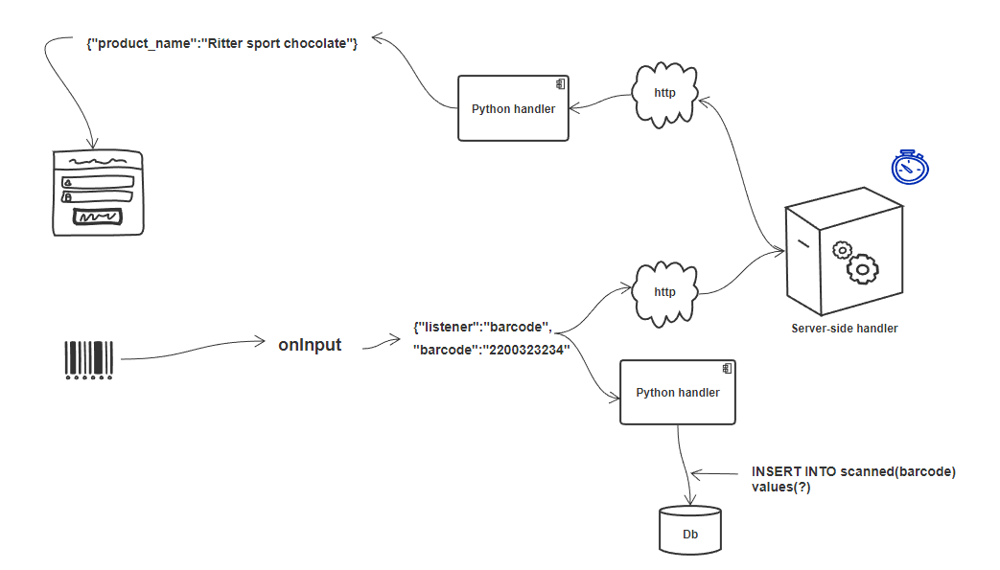
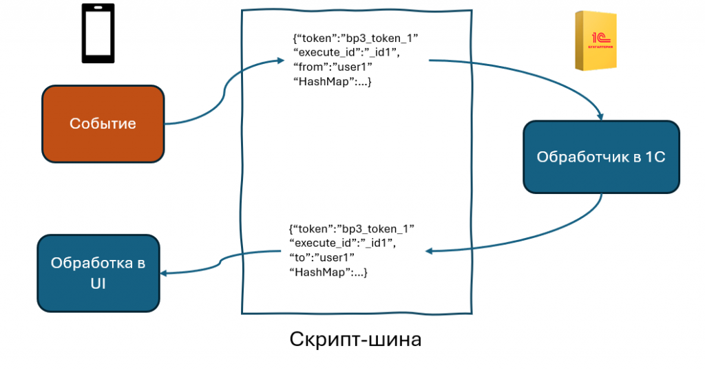

.. SimpleUI documentation master file, created by
   sphinx-quickstart on Sat May 16 14:23:51 2020.
   You can adapt this file completely to your liking, but it should at least
   contain the root `toctree` directive.

Communications
===================

Online handlers online and onlinews
--------------------------------------

Online handlers on the one hand execute the application logic (via variable commands and just variables). On the other hand, they can be considered a means of communication, since data can be transmitted through them, so they are in this section.

SimpleUI executes code online on the side of your accounting system either via HTTP request or via the bus. Commands and variables are exchanged between the device and the back-system in requests in the form of a stack of variables (HashMap). The syntax and principles in both cases for the developer are identical.

Option via HTTP service (online handler)
~~~~~~~~~~~~~~~~~~~~~~~~~~~~~~~~~~~~~~~~~~~~~~

This option will require the accounting system to publish an http service. The handler type in SimpleUI is online.

It is necessary to specify in the settings the URL, user name, and password of the web service where requests will be sent when processing the online handler

For 1C, this is the SimpleUISplit extension (download https://disk.yandex.ru/d/4tDOY5SjhmQrxQ) you need to install it, publish the http service and register the settings as shown in the picture (settings can also be transferred, for example, via a QR code)

The application sends a POST request of the form /set_input_direct/<method> and waits for a response. The request body contains JSON with the required keys:

 * hashmap – array of JSON objects with keys key, value. For example, ``[{"key":"ShowScreen","value":"Screen 1" }]``
 * ErrorMessage – empty string or string with error

In response, a message is received in the same format from which the stack of variables is assembled.

You can use header compression with the **_GZIP** flag (you need to place it somewhere at the beginning, before online handlers). It automatically unpacks incoming requests using the Accept-encoding: gzip header, and in order for it to pack outgoing json, you need to add the _GZIP variable somewhere in the initialization. This is precisely JSON compression/decompression, designed for weak channels (3G, bad WiFi).

When receiving such a request on the server side, the traffic must be unpacked accordingly. For example, in Python:

.. code-block:: Python

 inputdata = gzip.decompress(request.data)

There are situations when it is convenient to move the method in the request body, and not in the parameters. For example, a function like pythonargs some_function(a,1,?) But when passing via set_input_direct as a request parameter (in the URL) there may be overlays (this is still an HTTP request). Therefore, it is logical that the function name should be hidden in the request body. In order not to redo everything manually, I made the flag **_ENCODE_ONLINE** which redoes the requests of online handlers. The request is sent to **set_input_direct/hashMap** (instead of the method name, it is always hashMap), the method name inside hashMap is in the **online_method** variable. i.e. the function name is in the variable stack. Now in online handlers you can write not just the function name, but also set parameters.

Option via bus, via WebSocket
~~~~~~~~~~~~~~~~~~~~~~~~~~~~~~~~~~~~~~~~

Also, if there is no desire or opportunity to publish a web service to the Internet and your system can work with web sockets, then you can work through a bus (onlinews handler type)

The advantages of this approach:

 * Possibility not to publish 1C HTTP-service to the external Internet. Instead, a small script is published, optionally - either on your own server/computer, or on VPS. This allows even those clients who do not have either a 1C server or a server as such to work, and there is no need to transfer data to the cloud. Security remains at a level.
 * Increased productivity due to architecture and technology. The responsiveness of such requests is significantly higher than that of an HTTP request, due to the fact that there is no need to establish a connection. Also, the architecture of the execution of handlers is not synchronous, as in the case of a regular online, but always asynchronous, which allows you to unload the application. You can unload the back system by distributing the load on the bus
 * The application can work with an infinite number of servers, or distributed servers

Operating principle:

 * The "bus" script is published. For the purposes of handlers, a full-fledged SimpleBus bus is not needed, so I made a simplified script of one and a half hundred lines. Queues, data caching, http-interface and everything that is not needed are removed from there, only the necessary remains. GitHub here https://github.com/dvdocumentation/simplebuslite
By default, authorization is disabled, but you can create users (in the DBMS on the bus) and enable authorization.
 * All addressing works on "tokens". For example, you have a 1C: ERP configuration, you publish a token from it SimpleConnect_erp_692f4a8d_2c68_40be_82df_4f4b9224ee1e (the name is generated automatically) and the bus now "knows" that the token owner is this client SimpleConnect_erp_692f4a8d_2c68_40be_82df_4f4b9224ee1e. But the clients connected to the bus (Simple) do not know such a long token, they simply have "erp" written in their configuration - this is the token alias. The client stores a DB of tokens and their aliases. For example, the client reads your ERP settings via QR and now its Simple has remembered that erp is SimpleConnect_erp_692f4a8d_2c68_40be_82df_4f4b9224ee1e. Now, when it sends a request, it specifies this token in the destination. Sounds complicated? In fact, it is all done automatically. And this is necessary so that: 1) the client can work with several databases simultaneously within one configuration 2) so that it is possible to work in the cloud with one config, but different servers (for example, these examples for the article - everyone has bp registered, the bus is, for example, one (mine is on VPS), but everyone has different tokens, due to this architecture, everyone works within their own token)
 * Simple scans the settings once (they can also be set from the code) and starts sending synchronous and asynchronous requests. It works like this. An event occurs, the onlinews handler is launched. It can be synchronous, asynchronous or "with a progress bar". For each call, a unique execute_id number is welded on, which goes in the request to the bus, and then to the back-system, and then returns as a "response". The answer is in quotes, because in the web services architecture there are no responses, they are just messages. All this time, Simple patiently waits for a message from the bus with such an execute_id. In the case of a synchronous launch, it blocks the UI and "hangs" the system. In the case of runprogress, it shows a spinner. In the case of an asynchronous handler, nothing is blocked, but when a response is received, the postExecute handler can be executed
 * Along with the request, a stack of variables/commands goes back and forth. Waiting is limited by the waiting time (default 10 sec, set in the settings)
 * Thus, all processing is performed on the external system side. Debugging is, of course, also available on the external system side.

Extensions for 1C can be downloaded here https://infostart.ru/1c/articles/2305445/

SimpleBUS
-----------

A specially written for SimpleUI open source project for synchronization between SimpleUI and other solutions. Described in the SimpleBus section

.. note:: For handlers and debugging there is a simplified version of this script, see the Online handlers section

WebSocket
-----------

It is also possible to organize the work of the WebSocket client without resorting to the use of the SimpleBus bus and without using its standards. For this, there is an alternative option with WebSocket. Examples can be found here: https://infostart.ru/1c/tools/1901884/

Teams:

 * **ConnectWebSocket** – connect to a web socket. Example: ``hashMap.put("ConnectWebSocket","ws://192.168.1.41:8765")``

 * **WSOnConnectHandlers** – connect handlers for the event of a successful connection to a socket in the 2.0 architecture format.

Example:

``hashMap.put("WSOnConnectHandlers",json.dumps([{"action":"run","type":"python","method":"ws_connect"}] ))``

 * **WSOnMessageHandlers** - connect event handlers for receiving a message in the 2.0 architecture format. The message itself comes in the *WebSocketMessage* variable

 * **WSOnCloseHandlers** - connect handlers for the normal connection close event in the 2.0 architecture format.

 * **WSOnFailureHandlers** - enable connection loss event handlers in the 2.0 architecture format.

 * **WebSocketSend** – command to send a message to a socket.

 * **CloseWebSocket** – connection termination command. You can also close connections from the server side, for example.

Features of work:

 1. When the connection is broken, reconnection occurs automatically every second. To stop attempts, you need to delete the *ConnectWebSocket* variable

 2. When connecting initially, a message in the format ``id:<AndroidID>`` is automatically sent. This can be used to identify users, for example

HTTP requests
----------------

If online handlers (which are essentially HTTP requests) and a bus are not enough and you need to send http requests, you can do this:

 * From Python handlers, module **requests**
 * From JavaScript handlers, **XMLHttpRequest**

Work with Bluetooth devices, TCP/IP, USB
----------------------------------------------

Described in the Working with equipment section

GPS
------

In the settings there is a checkbox "Send coordinates" if you enable it, then in any process that is launched, special variables related to the geolocation service will be added.

.. note:: You need to give the app permission to determine your location in the settings. You also need to make sure that location is enabled on your device.

The device requests data every 5 seconds and sending occurs every time variables are sent. There may not be any data at the moment the process starts, you need to wait a little.

Data is requested and received from 2 providers - GPS and network (networks or Wi-Fi) - in the processor you can filter according to the fact.

Special variables to which the device transfers data:

 * **Latitude** – latitude
 * **Longitude** – longitude
 * **gps_city** – city, if present in the address
 * **gps_postal_code** – index
 * **gps_addres_string** – full unparsed information that can be parsed by tags
 * **gps_provider** – data source
 * **gps_accuracy** - accuracy

NFC
-------

You can use NFC tags in your identification solutions. The tags scan:
 
 * ID(serial number) – to variable **NFC_ID**
 * The recorded text, if any, is stored in the **NFC_TEXT** variable

There are 2 modes available:

 * Scan mode for recorded NDEF tags from everywhere. Only tags recorded that contain information in text form (mimeType: text/plain) – the event will come to the application service and will be processed in the general handler even if the application is turned off. Why such restrictions? Because the application filter is designed for this combination (NDEF+text/plain). That is, Android knows that it has an application installed (SimpleUI) that can process such tags. And when you bring the tag, it recognizes it, launches the application and then the general onNFC event is generated. That is, it is available without a process, in any mode. In principle, it can be used to launch processes from Android.

 * Scanning mode in any technology, any tag types. Starts on the screen if there is an NFC element on the screen (or the **onNCF** flag is added to the variables). The screen must be open (active). An input event is generated with listener=**onNFC**. The ID and, if any, the text are also read.

Examples can be found here: https://infostart.ru/1c/tools/2251192/

p2p data transfer in the absence of connection
-----------------------------------------

**DirectWIFI** in full duplex mode (each device is both a client and a server) https://t.me/devsimpleui/136

**Optical p2p data transfer** between devices https://t.me/devsimpleui/136

Optical Data Transfer ActiveCV Video: https://youtu.be/9Gwho6bWeKk Sources: https://github.com/dvdocumentation/simpleui_samples/tree/main/QR%20data%20sending and https://github.com/dvdocumentation/simpleui_samples/tree/main/QR%20data%20sending
