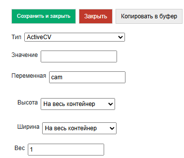

.. SimpleUI documentation master file, created by
   sphinx-quickstart on Sat May 16 14:23:51 2020.
   You can adapt this file completely to your liking, but it should at least
   contain the root `toctree` directive.

Computer Vision and Augmented Reality ActiveCV
========================================================

.. image:: _static/2025_cv_1.PNG
       :scale: 75%
       :align: center

ActiveCV is a technology for automating a business process, when all the necessary data of a business process is displayed not on the screen, but directly in the video stream, while various detectors work with the camera: barcodes, OCR, faces, etc. Also, the point of this action is in the continuous work of the operator without the need for any switching. For example, launched ActiveCV - scanned the room code, without interruption and without pressing anything, switched to scanning the inventory codes of equipment, VINs, then a series of photos of this equipment and all this, without switching to regular screens with buttons. And went on to other objects.  

An important feature of the technology is the illumination of objects in different colors – color marking. Examples of color marking:

 * the object is where it should be - green, where it shouldn't be - red.
 * the object is inventoried - green, not inventoried - yellow.
 * order is overdue by deadline - red, deadline is approaching - yellow, not overdue - green

.. image:: _static/2025_cv_3.PNG
       :scale: 75%
       :align: center

Examples (it is better to watch videos or GIFs) on the technology are collected in these articles (there were 2 generations of ActiveCV on the platform: the first, as an independent process - is outdated, as a screen element - is relevant):

 * https://habr.com/ru/articles/874560/
 * (obsolete) https://infostart.ru/1c/articles/1427287/
 * (obsolete) https://infostart.ru/1c/articles/1486598/
 * (obsolete) https://infostart.ru/1c/tools/1882131/

Overview of working mechanisms.
------------------------------------

Placement of a visual element.
~~~~~~~~~~~~~~~~~~~~~~~~~~~~~~~~~

The placement on the screen is no different from other container elements, but like for example the HTML field requires that **root container scrolling** be disabled. The visual element of the container itself is called ActiveCV. It can be placed on a part of the container, the entire screen. And also using the RunCV2 command, you can launch full-screen mode without any additional elements in a separate window.

Permission
~~~~~~~~~~~~

You can set the resolution for the detector **CameraSetResolutionAnalysis** and for the photo **CameraSetResolutionImage**. The preview resolution will not change - it is adjusted automatically. Also, the specified resolution may not be supported (especially for the detector) - the maximum possible will be set

Possible resolutions: ``"4K"(4096*2160))``, ``"2K"(2048*1080)``, ``"1080"(1920*1080)``, ``"720"(1280*720)``, ``"640"(640*480)``, ``"360"(360*240)``, ``"200"(200*200)``, ``"100"(100*100)``

Accordingly, the lower the resolution (especially of the detector), the faster and smoother the visual component works.

Detector operating cycle. General.
~~~~~~~~~~~~~~~~~~~~~~~~~~~~~~~~~~~

The detector is enabled/switched by the **CameraSetDetector** command, where the parameter specifies the detector type or types. Currently, ``BARCODE``, ``OCR`` and ``PHOTO`` are available.

If you need to combine several, then use underscores. For example, ``BARCODE_PHOTO``

When a new object appears in the frame that has not yet been recognized, the event (listener) **new_text_detected** or **new_barcodes_detected** is triggered depending on the detector. A string with a JSON array of frame objects - **detected_values** is available in the stack. The content of the recognized elements depends on the detector. In the handler of this event, it is possible to set the appearance of the recognized objects.

Displaying objects
~~~~~~~~~~~~~~~~~~~~~~~~

You can redefine the titles of recognized objects and set the color of the frame above them. All this is stored in one list **SetObjectsView** as a JSON array of objects with the fields id, color (HEX format) and caption. Id is a barcode or text, respectively.
For slow devices, the display is simplified. For fast devices, HTML strings are available in object headers using the **CameraSetPrettyView** command. That is, you can, for example, write in the caption ``"Product such and such, <b> balance such and such </b>"``. Also, in PrettyView, the header sections are built according to the size of the object, not the text, i.e. transfers occur. For such a display, you must additionally add the CameraSetPrettyView command with SetObjectsView

Manual control of the list of detected objects.
~~~~~~~~~~~~~~~~~~~~~~~~~~~~~~~~~~~~~~~~~~~~~~~~~~~~~~

By default, the **new_..._detected** handler (**new_barcodes_detected***, **new_text_detected**) is called on new objects, after which they are no longer considered "new", and events are not called on them. But you can control this manually using the **CameraSetOCRDetectedListManual** flag, an empty parameter, then manual registration using **CameraOCRAddDetected**, the parameter is a list of IDs. **CameraClearDetected** is also available, an empty parameter to simply reset the list of all detected objects.

Connecting the validator
~~~~~~~~~~~~~~~~~~~~~~~~~~

The principle of operation is the same for all detectors, but is called by different commands to combine fields subject to validation in one dataset. For example, in the examples in one dataset there is an article and a barcode. For barcodes, the command is **CameraSetBarcodeValidator** for OCR **CameraSetOCRValidator**

As a parameter – an object of the type ``{"dataserver":<dataset name>,"keys":[array of hash index names]}`` Records in the dataset have a field _Id (if it is not specified, it is set automatically, but you can write immediately with _id) – this is the first index. You can also add hash indexes for any fields in the dataset settings when creating. For example

``CreateDataSet("goods",json_to_str({"hash_keys":["article","barcode"]}))``

These fields will be used for searching and validation. When a validator is connected, events occur only if a record is found in the validator. Also, in the case of a validator, when a record is found in the output value, the entire dataset record itself will be added to the result field.

Zoom
~~~~~

**CameraSetZoom**, <parameter> – the number of the required zoom (the variable stack is a string, so both the numbers and other parameters are in the form of a string).

Stopping video stream.
~~~~~~~~~~~~~~~~~~~~~~~~

**CameraStopDetectorOnNewObjects** - enables the mode when the camera preview pauses automatically when an object is detected.

An alternative is to use the **CameraStop** command handler code.

Resumes - by refreshing the screen.

Flashlight
~~~~~~~~~~~~

**CameraTorchTurnOn** – turns on the camera backlight (if hardware capable)

Launch in a separate screen with return value
~~~~~~~~~~~~~~~~~~~~~~~~~~~~~~~~~~~~~~~~~~~~~~~~~

**RunCV2, <listener>** - runs ActiveCV from the screen on the entire screen until the first result is read, then closes the camera and generates an event with the event name specified in the parameter. This option is for situations when something needs to be read quickly, but you don't want to place an ActiveCV element on the screen or there is no way (the screen is small). In the example below, I use OCR purely for recognition on the new ActiveCV2 engine for the TSD variant. The TSD does not need a scanner via the camera (it has its own), but OCR is needed, but there is no place to place ActiveCV on the screen (the screen is small).

Features of the barcode detector
~~~~~~~~~~~~~~~~~~~~~~~~~~~~~~~~~~~

**CameraSetSupportedBarcodes** specifies a list of available barcodes separated by underscores. For example: ``hashMap.put("CameraSetSupportedBarcodes","QR_EAN13")``

If not specified, or ALL is specified, then everything is scanned.

List of available formats: ``QR``, ``EAN13``, ``AZTEC``, ``CODABAR``, ``CODE_93``, ``CODE_39``, ``CODE_128``, ``DATA_MATRIX``, ``EAN_8``, ``ITF``, ``UPC_A``, ``UPC_E``

**CameraSetCurrentBarcodeDetector** specifies a list of current barcode formats for dynamic switching. The format is similar to CameraSetSupportedBarcodes. In this case,
CameraSetSupportedBarcodes sets the formats that the camera is generally capable of reading. This is, so to speak, to speed up work and cut off possible errors. And CameraSetCurrentBarcodeDetector is for switching between formats during operation.

The array of barcodes in **detected_values** includes objects with the fields: **value** – the barcode as is (with special characters if any), **display_value** – the displayed value, **format** – the barcode format. And **result**, if a validator is used, with the dataset record itself.

OCR Features
~~~~~~~~~~~~~~~~~

The text block processing cycle includes several stages. All of them happen very quickly as they are performed by the platform. Therefore, I highly recommend not to give raw text passed through weak filters to the processors and process it as is there - this will be a much slower option than using masks, validators and preprocessing.
 
Text processing in ActiveCV
~~~~~~~~~~~~~~~~~~~~~~~~~~~~~~~

So, the text can be preprocessed, after which Regex masks are applied to it, after which more preprocessing procedures can be performed (some settings work before the masks, some after), after which it either goes to the validator or is given to the new_text_detected handler as is. If the task is, for example, to select all dates in a frame, then the validator is not needed, but if you check inventory numbers, then we connect the validator.

The CameraSetOCRFormatOptions command sets text preprocessing options. It can include several actions separated by underscores:

 * CLEARSPACES – removes various spaces
 * LOWER - converts to lower case
 * UPPER – converts to upper case
 * TOZERO – converts the letter O to zero

And some options that are executed after the Regex selection:

* DATE, INT, FLOAT – native text check for the corresponding type

The **CameraSetOCRMask** command sets a JSON array of mask strings. Each mask is a Regex expression. For example, "([a-zA-Z0-9-.]{5,10})" is a mask for searching for substrings that include Latin characters and numbers with a total length of 5 to 10 characters. It is convenient to check masks using Regex expression editors, for example https://regex101.com/ Each mask is applied sequentially, the one that is earlier in the array has priority.

**CameraOCRListOnly** flag to display not only the text after the validator, if there is one.

**detected_values** in OCR contain the fields:

 * value - text after all transformations
 * confidence - accuracy of determination
 * result - validator record

Examples of new_<barcodes|text>_detected + SetObjectsView handler:

.. code-block:: Python
 
 jvalues ​​= str_to_json(hashMap.get("detected_values")) #get an array of recognized objects
  
 #read previously created coloring of objects or create a new one
 if hashMap.containsKey("SetObjectsView"):
      objects = json.loads(hashMap.get("SetObjectsView"))
 else:   
      objects = []
       
 for item in jvalues ​​:
      res = item["result"]
      #This color and caption will be for new objects
      cv = {"id":item["value"],"color":"#82e0aa","caption":res.get("name")}
      id = item["value"]
      #We search for such objects in an existing coloring (they may have a different color)
      itemarr = next((itemo for itemo in objects if itemo["id"] == id), None)
      if itemarr == None:  
          objects.append(cv) #if not, then add
      else: #if there is, then repaint
          itemarr["color"] = cv["color"]
          itemarr["caption"] = cv["caption"]
  
 hashMap.put("SetObjectsView",json_to_str(objects)) #apply coloring
 hashMap.put("noRefresh","") #disable screen redrawing