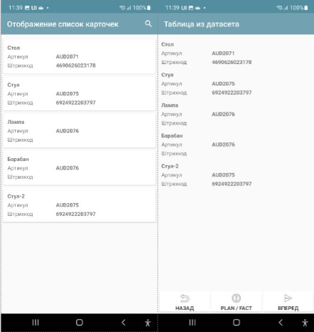
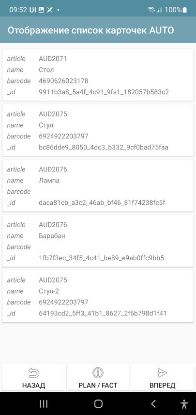
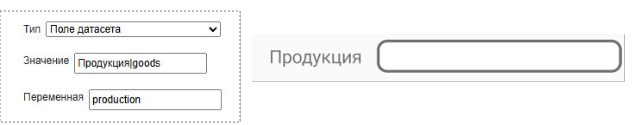
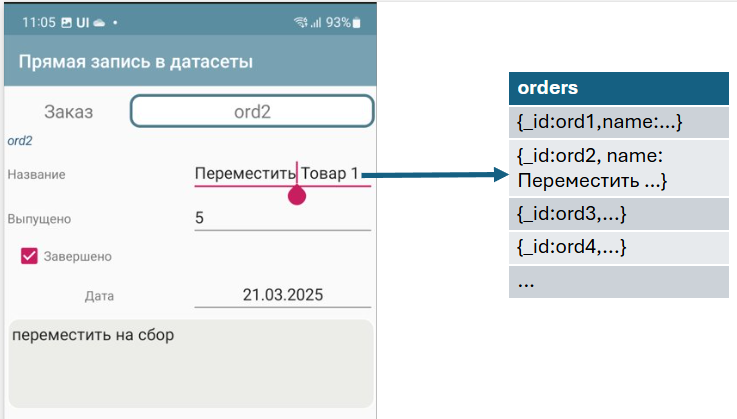
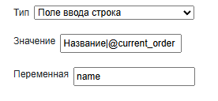

.. SimpleUI documentation master file, created by
   sphinx-quickstart on Sat May 16 14:23:51 2020.
   You can adapt this file completely to your liking, but it should at least
   contain the root `toctree` directive.

Datasets
============

Datasets are a data storage and manipulation mechanism, closely related to the platform's UI mechanisms (lists, ActiveCV, etc.). We can say that this is a primitive DBMS in memory (or even a dictionary in memory), which, if filled with data, immediately provides the application's logic.

A dataset as an object has a name, has some settings (indexes by fields, search field settings, etc.) and contains data that could be called an "array of objects". In the options, you can configure the behavior of the dataset - how the data will be searched, how a specific record will be displayed on forms, etc.

A reference to an object of any dataset in SimpleUI has the form ``<dataset name>$<_id of record>``. This is a universal reference in the system. You can always get a record of any dataset via ``DataSets.GetObjectStr(<reference>)`` or a view of an element via ``DataSets.GetView(<reference>)``.

In the code below: create a dataset, fill it with data and save it.

.. code-block:: Python

 datasrv = CreateDataSet("goods") #create dataset goods 
 
 #specify hash indexes, search fields by string, record presentation template
 datasrv.setOptions(json_to_str({"hash_keys":["article","barcode"],"search_keys":"name","view_template":"{name} , <b>{article}</b>"}))
 
 #add records to the dataset
 goods_list = []
 goods_list.append({"article":"AUD2071","name":"Table","barcode":"4690626023178"})
 goods_list.append({"article":"AUD2075","name":"Chair","barcode":"6924922203797"})
 goods_list.append({"article":"AUD2076","name":"Lamp"})
 goods_list.append({"article":"AUD2076","name":"Drum"})
 datasrv.put(json_to_str(goods_list))
 
 #write dataset to disk
 datasrv.save()

Using the dataset
------------------------

Tables and lists of cards
~~~~~~~~~~~~~~~~~~~~~~~~~~~~

If you have a dataset, then in order to place a list on the screen, it is enough to simply specify a link to it via ~ . Here is an example of a variable for a Table. Here the "goods" dataset is specified as the source, and the container in which the design of the list elements is set is "list_3_lines"

.. code-block:: Python
 
 j = { "customtable": {
          "layout": "^list_3_lines",
          "tabledata":"~goods"}
 }
 
 hashMap.put("table",json_to_str(j))
 

By the way, usually a container is drawn for the lines, but if you don't want to, you can just write AUTO and it will be generated automatically. As you can see in the screenshot, all fields are displayed, even _id. This can be useful at the development stage, the card form can be made later.

.. code-block:: Python

 j = { "customtable":{
   "layout": "^AUTO",
   "tabledata":"~goods"
    }
   }
 

When clicked, a CardsClick event is generated and a universal link ``(<dataset name>$<record_id>)`` appears in the variable stack in selected_card_key and also in **selected_card_data** – the dataset record data as a JSON string

You don't have to worry about searching either. The dataset has its own search settings section dataset_search, which contains method (search method), keys (search fields), and min_length (optional) - the minimum length from which the search begins.

The method can be:
 
 * text - for normal search by string entry
 * levenshtein - for fuzzy search by Levenshtein distance (results will be displayed in descending order of accuracy, with selection >75, the accuracy itself is added to the records in the _confidence field

By the way, there is now a search_submit option. If it is enabled, you need to press the input confirmation (search symbol on the keyboard), if it is not enabled, the search occurs when you type each symbol. For long lines and complex search algorithms, this is a more humane solution in terms of load.

Example of a table variable with search settings

.. code-block:: Python

 j = { "customtable":
 {
   "options":{
            "search_enabled":True,
 	    "search_submit":True,
            "dataset_search":{"method":"text", "keys":"name"}
     	   },
   "layout": "^list_3_lines",
   "tabledata":"~big"
    }
 }

Example with fuzzy search

.. code-block:: Python

 j = { "customtable":
 {
  "options":{
            "search_enabled":True,
	    "search_submit":True,
            "dataset_search":{"method":"levenshtein", "keys":"name","min_length":3}
    	   },
  "layout": "^list_3_lines",
  "tabledata":"~big"
   }
 }

About large datasets.
"""""""""""""""""""""""

By default, pagination is always enabled, it is invisible, smooth. By default, the page size is 100 records. But you can set your own size - through the numeric option page_size. Accordingly, to disable pagination, you need to write a large number there. But do not rush to disable it - with it, the lists are ready to accommodate millions of records without any signs of delay. Not the slightest delay. Here is a video with 1 million records in the dataset.
 
Dataset fields
~~~~~~~~~~~~~~~~

You can place reference data entry fields on the screen that contain links to dataset records.
 
You simply specify a variable in which the field value is or will be stored as a link and the dataset in the value. That's all. The user simply selects a record from the list, uses the search if necessary. When selecting, a universal link also gets into the variable.

For such a case, it is advisable to define 2 things in the dataset options:

 * Post view – **view_template** option. You can use html. Field names are specified in curly brackets. You can place several fields in the view. For example, {name}, {barcode}. You can use html. For example, ``{name}:<b>{article}</b>``
 * You can specify the shape of the list elements list_layout – container name (default is AUTO)

Example of creating and specifying dataset options:

.. code-block:: Python

 datasrv = CreateDataSet("goods")
 datasrv.setOptions(json_to_str({"list_layout":"item","view_template":"{name} , <b>{article}</b>"}))

You can use the | construct to place a field with a title

To set the field settings, there is a simplified version and a version with settings. The simplified version is given above, and for settings, you need to specify JSON settings (usually via a variable)
 
 * dataset (required) – dataset name
 * inline – search by string directly in the field
 * select – button to select from the list
 * spinner – selection from a list (analogous to a drop-down list) replaces the inline option
 * hint - hint
 
Examples of different dataset field settings:

.. image:: _static/2025_dataset_2.png
       :scale: 55%
       :align: center

Selected and preset values
""""""""""""""""""""""""""""""""""""""""

The universal reference is used everywhere - both as a result of user selection and for setting predefined values.
For example, let's create the nds dataset:

.. code-block:: Python

 datasrv = CreateDataSet("nds")
 datasrv.setOptions(json_to_str({"view_template":"Rate - {name}"}))
 
 nds_list = []
 nds_list .append({"name":"10%","_id":"VAT10"})
 nds_list .append({"name":"20%","_id":"VAT20"})
 nds_list .append({"name":"0%","_id":"VAT0"})
 datasrv.put(json_to_str(nds_list))

And on the screen in onStart we will set the VAT by default

.. code-block:: Python

 hashMap.put("nds","nds$VAT20")

Then, when you open it, you will see the result:
 

Direct connection of screen elements with dataset fields
~~~~~~~~~~~~~~~~~~~~~~~~~~~~~~~~~~~~~~~~~~~~~~~~~

If there is a universal link to the dataset, then you can link regular input fields to a specific dataset record on the screen. Then what the user enters in the fields will be written directly to the record. Moreover, it will be written as soon as the data changes (you only wrote one letter - the data is immediately written to the dataset field, without calling an event).
 
When you change the text in the input field, direct recording occurs

To do this, you need to specify a variable in the value that will contain a link to the record (universal link), and you need to place the name of the record field in the variable.

 
The current_order stores a link, name is a record field.

.. note:: In order for the system to correctly recognize such fields, the Value must contain a link, so if there is no link yet (for example, when opening), you need to put an empty link <dataset name>$)

Direct recording is possible with elements:
 
 * Input field string
 * Input field number
 * Password input field
 * Check mark
 * Date
 * Multiline text
 * Inscription

OCR and Barcode Validators in ActiveCV
~~~~~~~~~~~~~~~~~~~~~~~~~~~~~~~~~~~~~~~~~~

Datasets are also used as reference samples (validators) in text recognition (OCR) and for barcode validation. The fact is that they are very fast and, of course, this option is the most preferable for optical recognition.

Validators are reference samples for OCR or barcode scanning. When optical recognition finds an object, it returns a record. All you need to do is specify a dataset for the validator (in the dataset, you must specify which fields will be indexed). So yes, you can check the found test or
barcode in the handler, but the thing is that through the validator it happens many times faster and you don't have to write anything. More about validators - in the ActiveCV section.

Dataset as a data source
~~~~~~~~~~~~~~~~~~~~~~~~~~~~~~~~~

A dataset is a memory-resident data storage. And you can access this data. You can get all the records of the dataset all(), pages of records getPage(from,to). You can quickly get a record by _id or an indexed field. For example, if you go by barcode but do not use ActiveCV, but use a regular scanner and you have a dataset - "list of products with barcodes" then you can use it as a regular DB:

.. code-block:: Python

 goods = GetDataSet("goods")
 res = goods.get("barcode","4690626023178")
 toast(res)

Creation and filling of datasets, data manipulation.
---------------------------------------------------------

The dataset is created by the command ``CreateDataSet(<dataset name>)`` or ``CreateDataSet(<dataset name>,<options>)`` or the options can be set separately after creating the dataset object setOptions(<options>). Options are a json object of the form ``{"hash_keys":[<keys>,…],”key”:[<keys>,]}``. All options are optional.

Possible dataset options:

 * search_keys - keys (separated by commas) by which the search in the list is performed
 * view_template - presentation of an element in a dataset field. Keys are specified in the format {<key>}, it is possible to use html tags
 * list_layout - container for the selection list from dataset fields
 * hash_keys - an array of field names by which the hash index will be created.
 * key - you can specify a list of fields from which the id key will be generated if it is not specified, or you can simply specify the id in the entry, or if the id is not specified in the entry and the key is not specified, the id will be generated automatically.

You can also get a dataset by copying it from another dataset, then its options will be copied. The command ``copy(<new dataset name>)`` or ``copy(<new dataset name>,<start line>,<end line>)``

.. code-block:: Python

 my = big.copy("my")

Datasets are replenished with the put command, where a string with a JSON array is passed as a parameter.

Where does the data for the array in put come from? I'll give a few examples

Example 1. *Simply in the online handler*. Now in SimpleUI there are two types of online handlers - via HTTP request (online) and via web sockets + script bus, which I wrote about here. And actually you can call the online handler and put data into the dataset via put. But there can be a lot of data at a time and it will take a long time to transfer it via the handler. Let's look at other examples.

In the example below the language is Python, but it could be an online handler in the back-end system and the language would be, for example, 1C:

.. code-block:: Python

 hashMap.put("CreateDataSets",json_to_str({"goods_online":{"hash_keys":["article","barcode"]}}))
 data = {"goods_online":[{"article":"EZ9F34132","name":"SE 32A, 4500", "barcode":"3606480586873"},
 {"article":"EZ9F34116","name":"SE 16A, 4500", "barcode":"3606480586842"},
 {"article":"EZ9F34110","name":"SE 10A, 4500", "barcode":"3606480586835"}
 ]}
 hashMap.put("PutDataSets",json_to_str(data))

Example 2. *We have uploaded data from 1C to CSV and do not want to do REST or ODATA, we just put them in a file on Yandex Disk*. This example involves several mechanisms. First, the python handler works with the Yandex API to get an internal link, then a worker is launched to download (which will finish downloading the file, even after rebooting the device and with the application turned off), then, when the file is downloaded, we read the CSV and finally write it to the dataset. Brrr... complicated? Well, at least the file just lies on Yandex Disk, no need to start the server. In this example, you can write variations - the file is not CSV but immediately a JSON array, not on Yandex Disk but on the server with a direct download link. It is not necessary to use a worker - this is for large files.

.. code-block:: Python

 import requests
 from urllib.parse import urlencode
 from ru.travelfood.simple_ui import SimpleUtilites as su
 import os
 import csv
   
  
  
 base_url = 'https://cloud-api.yandex.net/v1/disk/public/resources/download?'
 public_key = 'https://disk.yandex.ru/d/U6YrMsXQmMbfOA'  
 
 # Get the download link
 final_url = base_url + urlencode(dict(public_key=public_key))
 response = requests.get(final_url)
 download_url = response.json()['href']
  
 # Option 1 - for small files
 #download_response = requests.get(download_url)
 #with open(su.get_downloads_dir()+os.sep+'p_menu.txt', 'wb') as f: # Specify the desired path to the file here
 # f.write(download_response.content) 
 
 # Option 2 - for large files
 def after_download_1():
      import csv
      with open(hashMap.get("DownloadedFile"), encoding='utf-8-sig') as f:
         reader = csv.DictReader(f, delimiter="\t")
         dataset = list(reader)
         goods =GetDataSet("goods_load")
         goods.put(json_to_str(dataset))
         hashMap.put("RefreshScreen","")    
         toast("Loaded...")
 	
 postExecute = json_to_str([{"action": "run", "type": "pythonscript","method":get_body(after_download_1) }])
 su.download(download_url,None,None,'goods.txt',postExecute)

Example 3. *We published the automatic aData interface from 1C in a few clicks and simply receive data from it directly**. How does filling the dataset look like in this case:

.. code-block:: Python

 import requests
 from requests.auth import HTTPBasicAuth
  
 orders = GetDataSet("orders_load")
 if orders == None:
     orders = CreateDataSet("orders_load")
     orders.setOptions(json_to_str({"view_template":"{Number}", "list_layout":"order", "search_keys":"Number"}))

     url = "http://192.168.1.41:2312/kademo/odata/standard.odata/Document_CustomerOrder?$format=json"
     r = requests.get(url,auth=HTTPBasicAuth('usr', ''))
     result = r.json()
     records = []
     for record_1c in result["value"]:
         new_record = record_1c
         new_record["_id"] = record_1c['Ref_Key']
         records.append(new_record)

     orders.put(json_to_str(records))
     hashMap.put("RefreshScreen","")    
     toast("Loaded...")
    
Data manipulation
------------------------

Copying
~~~~~~~~~~~~

.. code-block:: Python

 my = big.copy("goods") #copies completely

 #or  
 
 my = big.copy("big",0,3) #copies from 0 to 3 position

Selection
~~~~~~~~~~

The dataset can be filtered by a condition using the filter(<condition>) method, where the condition is specified in the same syntax as for Pelican/SimpleBase or MongoDB https://simplebase.readthedocs.io/en/latest/querys.html

Sorting

.. code-block:: Python
 
 my.sort("-name") #descending by name field
 my.sort("name") #ascending by name field

Cut
~~~~~~~~~~~

.. code-block:: Python

 my.cut(0,3)

Cleaning
~~~~~~~~~

.. code-block:: Python

 my.clear()

Fuzzy search
~~~~~~~~~~~~~~~~~~~~

The dataset has a method **findTextLevenshtein(String text,int confidence)**, to which the search string and the required accuracy are passed.

.. code-block:: Python
 
 ds = GetDataSet("goods") #get dataset with goods
 goods_select = CreateDataSet("goods_select") #create a new dataset for search results
 results = ds.findTextLevenshtein("name",hashMap.get("voice_text"),75) #call fuzzy search, accuracy 75
 goods_select.put(results) #write results to a new dataset

The output will be records for the dataset with the appropriate accuracy, sorted by accuracy in descending order. Each dataset element will have a **_confidence** accuracy field added.

Storage/Loading
-------------------
The dataset object has 2 methods without parameters **save()** and **load()**. In addition, the dataset has a method **isSaved()** that returns True if the dataset was written and **last_saved()**, which returns the date of the last save.

Explanation of the use of datasets in SimpleUI in terms of local storage. In what cases can and should you abandon the DBMS in favor of a dataset.
~~~~~~~~~~~~~~~~~~~~~~~~~~~~~~~~~~~~~~~~~~~~~~~~~~~~~~~~~~~~~~~~~~~~~~~~~~~~~~~~~~~~~~~~~~~~~~~~~~~~~~~~~~~~~~~~~~~~~~~~~~~~~~~~~~~~~~~~~~~~~~~~~~~

Let's take a closer look at the data flows that appear in the mobile solution. SimpleUI is a framework for business applications and, one way or another, solutions based on it are a kind of application or extension of the functions of back-systems (ERP, MES, WMS, etc.). That is, it is a kind of front. Even if the configuration is "independent" and works locally, it most likely interacts with the back-system at some point - takes or gives data. That is, the solution can be online with the back-system, offline, and what I call "pseudo-online" (when data is written locally and sent as quickly as possible), but one way or another, its existence makes sense only if it exchanges data with one or more systems for which it works.
 
Different classes of data in a mobile application
~~~~~~~~~~~~~~~~~~~~~~~~~~~~~~~~~~~~~~~~~~~~~~~~~~~~

What kind of data comes and goes? I divided it into classes in order to understand how to work most conveniently with different classes of data.

By dividing the data, I made the assumption that different classes of data require different approaches, that there is no single super-DBMS for a mobile solution (based on a combination of criteria), and that a differentiated approach is needed to select a storage tool depending on the life cycle of the data. It is the life cycle that
The cycle within the application defines the requirements for the storage tool.

And datasets are, first of all, data that comes to a mobile device from outside, from the back-system. These are, first of all, reference books, but also documents, tasks, orders. That is, what does not change in a mobile application, but simply exists for reading and, as a rule, has links to objects of external systems. So
Do you need a DBMS for something that doesn't change? After all, there is no rewriting at critical moments for performance - when the user is working with the UI, there is no deletion. A simple CSV or JSON file would be quite suitable for this purpose. Yes, with 1 million records, loading a large JSON will take 0.5 seconds, but this loading occurs in the background at certain times and does not interfere with work.

.. note:: When it comes to decisions related to goods or equipment/fixed assets, I recommend using the principle of a flat table (1NF), i.e., for example, if a product is identified by a barcode, then create a table Barcode-Article-Product Name-Unit-Product Link-Unit Link. Yes, it is possible to create several tables in a relational DBMS with external links? Why? When a product is scanned (or searched by article), you instantly receive all the data on the product. Nothing else is needed on the front end.

What and how do we win with Datasets? And due to what principles?
~~~~~~~~~~~~~~~~~~~~~~~~~~~~~~~~~~~~~~~~~~~~~~~~~~~~~~~~~~~~~~~~~

**The first principle** is deep integration into the platform mechanisms. For example, it is enough to place data in a dataset and we already get a display in the form of lists with the desired design (the design is set by containers). As happens with any DBMS - the data must be selected, a list of records must be formed and placed in the list adapter (here you also need to remember about JSON transformations). But here you don’t need to do any of this - the list at the application level takes data from the dataset. The video above shows how a list with 1 million records works. This is a consequence of the integration principle. The same thing with OCR - when text flashes in the video stream, you need to get to the data very, very quickly, otherwise everything will not be smooth.

**The second principle** is the lack of need to maintain data. A dataset is just put, save/load basically (no, there is also get and selections and manipulations as desired). It can be replenished in upsert mode by key, but by and large it exists as a simple list that can be saved/loaded. No need for Insert/Update/Delete and selections. It is just a list hanging in memory that can be saved/loaded. It is not a DBMS.

The place of Datasets in storage architecture. Differentiated approach to storage.
~~~~~~~~~~~~~~~~~~~~~~~~~~~~~~~~~~~~~~~~~~~~~~~~~~~~~~~~~~~~~~~~~~~~~~~~~~~~~~~~~~~

SimpleUI has a whole palette of DBMS. It would be possible to store all data in JSON-oriented noSQL Pelican. But it is recommended to conditionally divide the data into classes. Then you can select simpler tools for each class:

 * key-value for constants, settings, user input caching, logs
 * data from external systems (directories, documents, links) - datasets
 * data created in the application, documents, local accounting objects - Pelican, which again uses universal dataset links, for example.

This is the division of approaches offered to the developer. For example, in the dataset field, select a product (receive a universal link), and indicate the quantity on the screen. And record all this in the Pelican DBMS

.. code-block:: Python

 db = Pelican("samples_db1")
 db["orders"].insert({"sku":"goods$100","qty":10})
