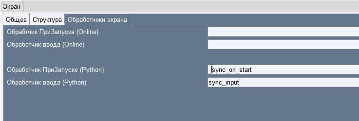
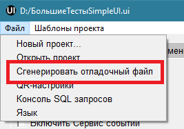

.. SimpleUI documentation master file, created by
   sphinx-quickstart on Sat May 16 14:23:51 2020.
   You can adapt this file completely to your liking, but it should at least
   contain the root `toctree` directive.

About debugging
=============

Debugging in online mode
--------------------------

Online mode means that the handler code is executed on the back-end, i.e. on the server. Accordingly, you can easily use debugging by means of the server. For example, if 1C is used as a back-system, then for debugging you need to:

 * In the server common module (for example, DebugProcesses), move the handler code into separate procedures. For example, ``Handler1(Variables,StringTable,Error,ErrorMessage) Export``
 * In the corresponding handlers, add a call to this procedure ``ProcessDebugging.Handler1(Variables,StringTable,Error,ErrorMessage)``
 * Enable debug mode on the server, enable Automatic connection to HTTP services and pass the handler in debug mode

Also, to understand the work and what is transmitted Sometimes it may not be superfluous to intercept the handler of the set_input method of the SimpleWMS HTTP service - there you can see what data comes in addition to the variables in the JSON response

Debugging handlers on the device
---------------------------------------

.. warning:: Currently, the current debugging method is "Bus debugging". There is no text description, it is not really needed. Video here: https://youtu.be/rjEnX8NpF3Y?si=VfRpn-uiT4PTS25I

Developing offline scripts involves using several tools and techniques to view the contents of variables, DBMS, and debugging.

Query Console
~~~~~~~~~~~~~~~~~

In the Device storage section.

Logging
~~~~~~~~~~~~

To obtain intermediate data, you can use logging and output toasts in a special way (inside the handler code). In this way, you can get both the values ​​of variables and, for example, log query datasets not at the beginning/end of the handler, but inside the code.
Log entries are sent via http requests, the demo database has a python_debug service and a scLogPython information register where the values ​​are written.
Here is an example of a general service procedure module for this:

.. code-block:: Python

  import sqlite3
  from sqlite3.dbapi2 import Error
  import requests
  import json
  import java
  from requests.auth import HTTPBasicAuth
  from com.chaquo.python import Python

  # Procedures for debugging python scripts
  def query_to_json(query, args=()):
      conn = sqlite3.connect('//data/data/ru.travelfood.simple_ui/databases/SimpleWMS')
      cursor = conn.cursor()
      cursor.execute(query, args)
      r = [dict((cursor.description[i][0], value) \
                 for i, value in enumerate(row)) for row in cursor.fetchall()]
      cursor.connection.close()
      return r
  
  def send_debug_msg(hashMap,tag,message):
      username=hashMap.get("WS_USER")
      password=hashMap.get("WS_PASS")
      url = hashMap.get("WS_URL")
  
      py_toast(url)
  
      r = requests.get(url+"/python_debug?tag="+tag+"&message="+message, auth=HTTPBasicAuth(username, password),
	     headers={'Content-type': 'application/json', 'Accept': 'text/plain'})
  
  def send_debug_query(hashMap,tag,message,query, args):
      username=hashMap.get("WS_USER")
      password=hashMap.get("WS_PASS")
      url = hashMap.get("WS_URL")
  
      r = requests.get(url+"/python_debug?tag="+tag+"&message="+message, auth=HTTPBasicAuth(username, password),
  	   headers={'Content-type': 'application/json', 'Accept': 'text/plain'},data=json.dumps(query_to_json(query, args=())))
  
  
  def py_toast(msg):
          from android.widget import Toast
          Toast.makeText(Python.getPlatform().getApplication(), msg,
                         Toast.LENGTH_SHORT).show()
  
  Description:

**send_debug_msg** – sends messages to the log

**send_debug_query** – executes a custom query with parameters, packs the result into a JSON dataset

**py_toast** – displays a toast inside a script using the Android SDK. Works only from Python handlers

Example of use:

.. code-block:: Python

  import sys
  sys.path.append("/data/user/0/ru.travelfood.simple_ui/files")
  import ui_global
  import json
  a = 2
  hashMap.put("a","1")
  ui_global.py_toast(hashMap.get("a"))
  ui_global.send_debug_msg(hashMap,"line 3",str(a))
  a+=1
  ui_global.send_debug_msg(hashMap,"line 4",str(a))
  ui_global.send_debug_query(hashMap,"sql","SELECT * FROM goods_bp","SELECT * FROM goods_bp",None)
  
Development and debugging via HTTP service
~~~~~~~~~~~~~~~~~~~~~~~~~~~~~~~~~~~~~~~~~~~~~

The idea is very simple – debug local python scripts in Python IDE (PyCharm, Thonny, Studio Code, etc.) via HTTP server – Flask. Device events, current variable stack, debugging and other IDE tools (syntax control, etc.) are available. That is, the Python handler is transferred to the web server and debugged there.

The work order starting from release 9.35 is as follows (the _debug_template.py template should be in the editor folder):

 1. The names of Python handlers that need to be debugged are temporarily prefixed with "_"

 2. The menu item "Generate debug file" is called

 3. The resulting script is placed in the editor folder in debug_handlers.py, you need to run it in debug mode and set breakpoints
 4. In the application settings there should be a Split mode, arbitrary authorization, in the Parameters of access to handlers in the URL - <debug server address>:2075, The connection attempt limit should either be increased or set to "0" (no limit)
