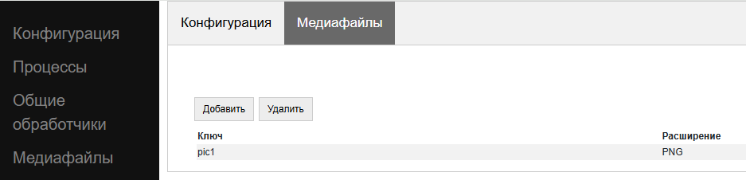

.. SimpleUI documentation master file, created by
   sphinx-quickstart on Sat May 16 14:23:51 2020.
   You can adapt this file completely to your liking, but it should at least
   contain the root `toctree` directive.

.. SimpleUI documentation master file, created by
   sphinx-quickstart on Sat May 16 14:23:51 2020.
   You can adapt this file completely to your liking, but it should at least
   contain the root `toctree` directive.

Files. Static resources. Image files.
=====================================================

All files are stored in the internal folder of the SimpleUI application, which is fully accessible from the application itself, but is not accessible to other applications (except through root). Any operations can be performed with files from python handlers - read the contents of the folder, read files, write, etc. That is, for example, you can intercept a picture taken from a camera and perform cropping, compression in the python handler and then send it to the resource.
For example, knowing the path to a file, you can open it:

.. code-block:: Python

 with open(filename, "rb") as image_file:
        image = image_file.read()

Each configuration is allocated a folder equal to the UID of this configuration (which is written in the ConfigurationSettings object), in which 3 subfolders are created as needed: **Data** (for its files), **Downloads** (for downloads) and **Datasets** (for datasets). Databases (Pelican, SQLite) are placed in folders by default (without dividing into configurations), but they can be placed in the Data config by specifying the path forcibly. For Pelican, the optional parameter **data_folder** can be specified in the initialization string; if you set it to True, the Pelican DB will be placed in the Data\Pelican subfolder.

To get a folder in SimpleUtilites (in pythonscript it is already imported as se), the methods **get_downloads_dir()**, **get_data_dir()**, **get_datasets_dir()** have been added; also, in pythonscript, to avoid bothering, the constants **_data_dir** and **_downloads_dir** have already been pre-filled.
SimpleUtilites also has a **delete_root_dir()** method to delete all configuration folders.

Open and save file dialogs from the screen
---------------------------------------------------------------

Opening a file via a dialog (picker) consists of a command variable and an event handler.

.. hint:: You can open files not through the dialog, but by opening the file with the Simple application via Open (the corresponding general handler is available).

**OpenExternalFile** , an empty parameter – a command to launch a dialog; when a file is opened, a **FileOpen** event is generated, which can be intercepted in a handler of the *pythonbytes* type, which receives the byte array of the open file.

Saving a file is also available.

**SaveExternalFile** , parameter: {"path":<path to internal file>,"default":<default name>} – command to launch the dialog for selecting the location to save the file and the file name (you can select the default name). If saving is successful, the event onInput listener = **FileSave** is generated

Saving to Downloads
------------------------------------------------

In the Java class SimpleUtilites there is a method **download_file(<file name>)** which saves a file (generated in the application folder) to the external Downloads folder (Downloads collection).

This way you can export information as files.

Downloading large files
-----------------------------------------
SimpleUtilites has a worker for downloading large files. It uses download resumption, works even after restarting the device (if it didn't manage to finish downloading), shows progress and finally puts the configuration file in the Downloads folder and calls an event. The download(String url,String user,String password,String filename,String postExecute) method does basically everything it needs.
Here is an example of downloading large files from Yandex-disk. It is done in pythonscript, and the postExecute handler is written there, and is packed using the **get_body** function

.. code-block:: Python

 import requests
 from urllib.parse import urlencode
 from ru.travelfood.simple_ui import SimpleUtilites as su
 import os 

 base_url = 'https://cloud-api.yandex.net/v1/disk/public/resources/download?'
 public_key = 'https://disk.yandex.ru/d/U6YrMsXQmMbfOA'
 
 # Get the download link
 final_url = base_url + urlencode(dict(public_key=public_key))
 response = requests.get(final_url)
 download_url = response.json()['href']
 
 # Option 1 - for small files
 #download_response = requests.get(download_url)
 #with open(su.get_downloads_dir()+os.sep+'p_menu.txt', 'wb') as f: # Specify the desired path to the file here
 # f.write(download_response.content)
 
 # Option 2 - for large files
 def after_download_1():
      with open(hashMap.get("DownloadedFile"), encoding='utf-8-sig') as f:
          toast("Downloaded file: "+hashMap.get("DownloadedFile"))
          hashMap.put("RestartScreen","")
 	
 postExecute = json_to_str([{"action": "run", "type": "pythonscript","method":get_body(after_download_1) }])
 su.download(download_url,None,None,'goods.txt',postExecute)
 
I'll say right away that using this particular worker is not necessary. You can simply download, for example, requests and write to a file, especially since the simple has runasync and runprogress, but Google recommends workers. It's also convenient because you can start several downloads at once and see the progress in the notification curtain.

Static resources
-----------------------------

It makes sense to transfer various static decorations (pictures displayed on screens or menus, html layouts, small python libraries) together with the configuration. When loading the configuration, they are saved in temporary files under a specific uuid, and to access them, you need the key specified on the Media tab

If the static resource is a picture, then to display it on the form it is enough to specify its key with the prefix **^** . That is, the Picture element in “Filling the field” will have ``^pic1`` , where pic1 is the picture key on the Media Files tab

You can access any static resource by key, get its absolute name and then do whatever you need with it:

.. code-block:: Python

  from ru.travelfood.simple_ui import SimpleUtilites as suClass
  filename = suClass.get_stored_file("key")

Images via files.
----------------------------------------------

Files generated on the device include images from the camera or media gallery of the device, loaded with the **mm_local** key, the work with which is described in the relevant sections. When saving such files, a uuid is generated, by which it can be accessed. This uuid is equal to the file name. You can simply work with the file name, storing it in your data structures. For example, when taking a photo in mm_local mode, an absolute path with the _path prefix is ​​saved in a variable (let's say the camera variable is called photo), that is, in this case, the variable will be photo_path.
Files in containers should be accessed via **~<absolute path to file>** so that the system understands that you are transferring an image as a file. The thing is that by default it expects a base64 string. If possible, use files rather than base64, especially in list cards - it is more productive. This is described in more detail in the column "Mode of working with image files directly by absolute path (via ~)"
The application package includes Pillow, which allows you to work with images - resize, etc. Here is an example of opening a file and sending it by request

.. code-block:: Python
  
  import json
  import requests
  import base64
  from PIL import Image
  import os
  from pathlib import Path
  from io import BytesIO
  from requests.auth import HTTPBasicAuth

  #...

  filename="path_to_file.jpg"
  if os.path.exists(filename):
        image = Image.open(filename)
      
        image.resize((500, 500))
        buffered = BytesIO()
        image.save(buffered, format="JPEG")
        img_str = base64.b64encode(buffered.getvalue()).decode('utf-8')

        username=hashMap.get("WS_USER")
        password=hashMap.get("WS_PASS")
        url = hashMap.get("WS_URL")

        r = requests.post(url+'/data_upload', auth=HTTPBasicAuth(username, password,),
	   headers={'Content-type': 'application/json', 'Accept': 'text/plain'},data=json.dumps({"file":filename,"base64":img_str}))

The example above passes the content as a base64 string, but for files, especially large ones, it's better to use the streaming option that requests supports:

.. code-block:: Python

  with open('image-1.png', 'rb') as img_1:
      r = requests.post(url, auth=basic, data=img_1, headers=headers)

Temporary files
--------------------

For convenience, it is possible to generate temporary files of the required extension using the **get_temp_file** method

.. code-block:: Python

 from ru.travelfood.simple_ui import SimpleUtilites as subclass
 output_file = suClass.get_temp_file("txt")

