.. SimpleUI documentation master file, created by
   sphinx-quickstart on Sat May 16 14:23:51 2020.
   You can adapt this file completely to your liking, but it should at least
   contain the root `toctree` directive.

Screens
===========================================

Screens, general
------------------

Screens are used to draw visual elements. Most visual elements are placed in containers on the screen, and there are also elements of the screen itself.

Processes are just a set of screens. All logic is concentrated in screens - handlers, active elements, etc.

Elements placed on the screen are filled either from constants or from stack variables or from slices. For example, you placed a button on the screen. It has a Value, for example "Write"

It looks like this in the designer and on the form

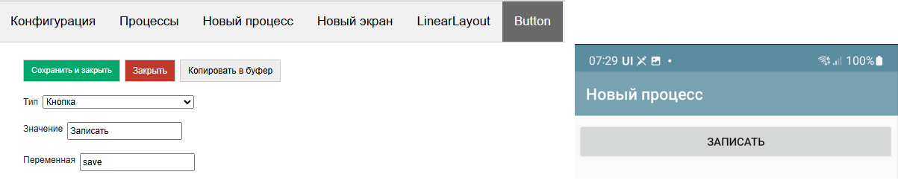

But you can define the value as @btn_caption, having previously written the value “Record Document #1” to the btn_caption variable.

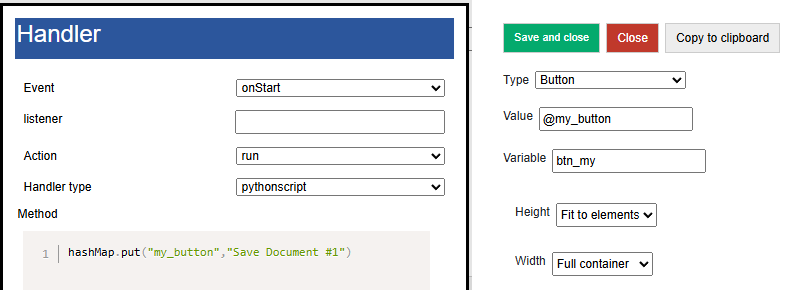

Then when drawing, it will be like this

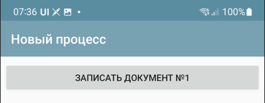

When a process is launched, the first screen of the process in the list is always launched. When the screen is launched, two events are drawn and executed one after the other - onStart and onPostStart.

In general, there are only 3 types of events on the screen:

 * **onStart** – event at startup, but before rendering. Here you can place a handler that will fill the screen variables associated with visual elements. You should keep in mind this nuance: if the handler is fast, you can use the run execution type. And if it is long, then runasync or runprogress (otherwise, opening the screen will hang, which is unaesthetic and can attract the attention of the OS). At the same time, if you use an asynchronous handler, you should understand that it will end when the screen has already been rendered, and in order for the visual elements that you filled in such a handler to appear (for example, you filled a large list), you need to redraw the screen with the RefreshScreen command. In general, onStart is mainly used to fill visual elements and initialize variables.
 * **onPostStart** event after rendering elements. In some cases, you need to handle the element when it is already placed on the screen
 * **onInput** – any input events: pressing a button, reading a barcode, selecting a menu, etc. With rare exceptions, an input event entails **screen redrawing**. Accordingly, after onInput, the elements will be recreated and the onStart and onPostStart handlers will be launched.

As you can see, all the variety of input events is collected in onInput, so any input event also has a listener attribute so that they can be separated.

Screen and process management commands
---------------------------------------------

**ShowScren, <screen name>** – switches to another screen in the process. That is, if the process has Screen1 and Screen2, then ShowScreen, Screen2 will cause Screen2 to launch with the corresponding onStart, onPostStart events.

Example (here and below, command examples are written for python, if you have other handlers, translate them to your stack)

.. code-block:: Python

 hashMap.put("ShowScreen","Screen 2");

**ShowScreen,<ProcessName>|<ScreenName>** - command to borrow the screen from any process (not necessarily the current one). It is good because it works without restarting the process, unlike StartProcess (and restarting is a rather expensive process, during which the initialization of the equipment and other long things occur)

.. code-block:: Python

 hashMap.put("ShowScreen","General forms|Screen 2");

**ResreshScreen, without parameter** – update (redrawing the screen) without calling onStart/onPostStart. Needed to redraw elements from filled variables. Must be used with any async. Also, see below the UpdateLayout command for partial update of the selected container.

**RestartScreen, without parameters** – restarts the screen, with onStart/onPostStart execution

**StartProcess, <process name>** – start a process from a process

**ShowProcessScreen, <process name>** – launch a process from the background (when no process is running)

**FinishProcess, without parameter** – process termination

General screen functions
--------------------------

Screen timer
~~~~~~~~~~~~~~~~~~

You can define a timer on the screen that will periodically generate an input event (the timer frequency is set in the general settings). This feature was introduced before asynchronous handlers appeared in the platform. Most scenarios that require a timer are implemented much more efficiently on asynchronous and the system does not need to constantly twitch the screen, moreover, it is also a faster response. Therefore, before using a timer, it is recommended to look at asynchronous screen calls or an event service.

Hide top bar
~~~~~~~~~~~~~~~~~~~~~~~~

Hides the toolbar in the screen. If there is a search in the toolbar or menu, it is better not to do this

Bottom Panel and Hide Bottom Panel property
~~~~~~~~~~~~~~~~~~~~~~~~~~~~~~~~~~~~~~~~~~~~~~

In SimpleUI, due to compatibility, there is a panel with the Forward (listener-empty line), Back and Plan-fact buttons on the screen by default. This is an outdated rudiment and it is recommended to disable it by checking the "Hide bottom panel" box.

Disable Root Container Scrolling
~~~~~~~~~~~~~~~~~~~~~~~~~~~~~~~~~~~~~~~~~~~~

All screen elements are displayed in an infinite vertically scrollable container by default. But in the case of, for example, lists (which themselves have their own scrolling), this creates an incorrect situation. For example, you cannot place a list "on the entire screen" if this screen is infinite. So you need to limit it (fix it). For this, there is an option Disable root container scrolling.

Close without question
~~~~~~~~~~~~~~~~~~~~~~~~~~~~

By default, when closing a screen/process with the back (system) button, the user is asked a question. This checkbox can be used to disable this dialog.

Connect keyboard handler
~~~~~~~~~~~~~~~~~~~~~~~~~~~~~~~~~~~

When the flag is enabled, when one of the key combinations is pressed, the listener= keyboard event is generated and the read key is returned to the keyboard variable.

The list of keys is as follows (in normal mode):
 * combinations with Ctrl
 * combinations with Alt
 * combinations with Shift
 * F1-F12

You can also check the **"Intercept all keys"** box in the application settings, then absolutely all keys will be returned, and in the form of 2 events - pressing and releasing. It is important to remember - in this mode, key codes are written with the prefixes #up and #down - this must be taken into account in the handlers.
In order to understand what codes the keys have, you can use the main menu item "Keyboard Test"

Screen Elements
-----------------------

Below are all the current screen elements listed (elements not mentioned are left for compatibility with older configurations)

 * **Container** – a markup element and a container for other visual elements. More details in the section "Screen Markup with Containers"
 * **Barcode** – connection to the screen of the barcode reader. Barcodes can be read via connected equipment (more details in the Equipment section) or via a camera. If a barcode element is connected to the screen, a floating "Barcode" button appears on the screen, which starts reading by the camera. If this button is not needed, it can be hidden in the general settings of the "Hardware Scanner" application. Barcodes can also be read by ActiveCV (described in the ActiveCV section) in a more advanced form. This option (in the case of a camera) simply returns 1 barcode per launch (no stream scanning). In the element, you need to define a Variable where the barcode will be returned. When reading (it doesn't matter whether by camera or equipment), the listener=barcode event is generated and the read barcode is written to the Barcode variable
 * **Voice** Voice recognition is launched. The element must define a Variable where the result will be returned. If successful, the listener=voice event occurs and the result is placed in the variable. It is also possible to launch recognition from code, see the Voice and speech synthesis section.
 * **Signature** Entering a signature from the screen. You need to define a variable where the base64 signature image will be written. If the signature is successfully entered, the listener=signature event is generated
 * **Camera Photo**, **Gallery Photo**, **Horizontal Media Gallery** and **Slider Gallery** More information about these elements is written in the Working with Media section
 * **Menu element** You can add an element to the options menu (in the toolbar). The element must have a Value - the name of the menu item and a Variable - it will be returned to the listener when the menu item is selected. Moreover, if the value is set as an Awesome icon (see the Awesome item), then such a menu item will be in the toolbar
 * **Floating Button** You can place your own buttons above the screen, at the bottom right. You need to define a Variable and Value for the element. In Value, you can either write the name of one of the predefined icons or use an Awesome icon. Predefined: ``"forward","backward","run","cancel","edit","picture","info","settings","plus","save","search","send","done"``. Awesome ones are described in the Awesome Icons section below. Since the icons are generated, they have different proportions. Therefore, it is advisable to use x and y shifts in the Floating Button. For example, this is how the "star" icon is defined, but with an X shift of 0 and a Y shift of -15: #f005;0;-15. If you do not use the y shift, the star moves down.
 * **NFC** Connecting NFC reader. Described in the NFC section.

Container marking
-----------------------

Height, width, weight
~~~~~~~~~~~~~~~~~~~~~~~

Visual elements are inside containers. The screen must have at least one container (root) in which elements are placed, including other containers. Containers can have **horizontal** and **vertical** orientation (Orientation property (key orientation))
**Height** and **width** of the container can be:

 * **"Full width"** (match_parent) – the container takes up all the space along the selected axis.
 * **"By element size"** (wrap_content) – the size is determined by the corresponding maximum size of the nested elements
 * **Manually defined** – a numeric value in relative screen units

If we want to split the screen into zones (in half or in other proportions) vertically, then first of all we need to **Disable scrolling of the root container**. That is, we are not working in an infinite scrolling screen, but within the framework of one screen with a finite height and width.

Both containers and the elements within them follow the same placement rules.

If you need to distribute several elements within a container proportionally to their width or length, you need to do the following (an example for horizontal distribution, a similar rule applies to vertical distribution):

1) Elements must be included in a horizontal container (type: LinearLayout, orientation:horizontal), with a width of match_parent

2) the elements inside must have a width = 0

3) elements must have a weight (weight key) in the proportions in which the elements need to be distributed on the screen.

For example, if two elements should divide the width in half, then both should have a weight of 1, if one should be twice as wide, then it should have a weight of 2, and the other - 1. That is, the weight is the proportion or weight of the element within the container along the axis.

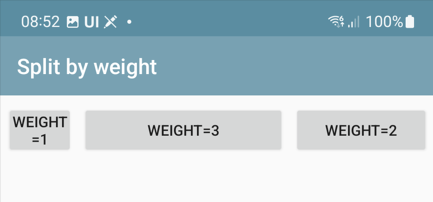

Another common layout option: *you need to stretch an element, but leave space for elements above and below. For example, you have several elements above, and you want to place a block of buttons below. The space between them can be empty, or occupied by a list, as an option.*

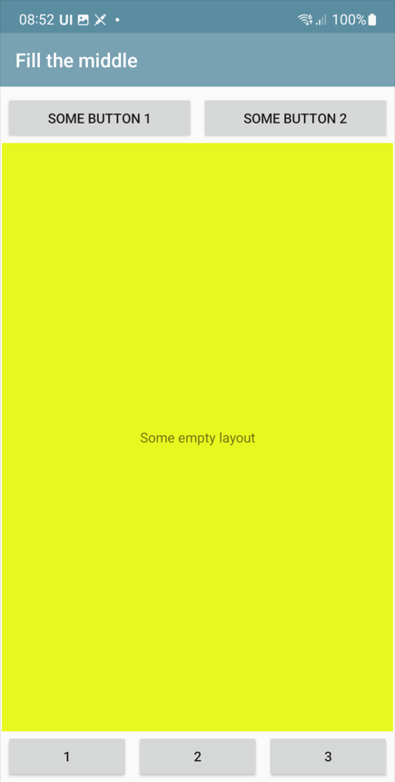

.. warning:: Important! If you want to stretch something along the vertical - be sure to disable the scrolling of the root container!

To do this, the elements at the top have a height equal to the size of the elements (wrap_content), at the bottom - also equal to the size of the elements, and the element in the middle has **height("height")=0 and weight(weight)=1**

The two examples above are here: https://disk.yandex.ru/d/JOJh0OtV1aAdig

Configuration section Containers
~~~~~~~~~~~~~~~~~~~~~~~~~~~~~~~~

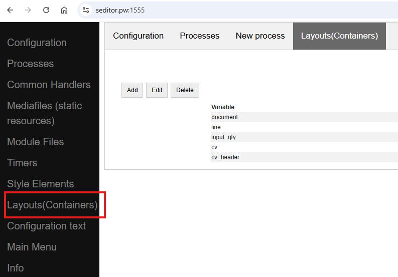

Containers are used in screens, list item layouts, dialogs, and the SetRootLayout command. In all of these places, you can define a container directly as a JSON string. But often, for example with lists and dialogs, you store containers in a separate place (the Containers configuration section (the Layouts array in the configuration structure)), and use a reference to the container variable when defining lists or dialogs, or in setRootLayout.

In the Containers section, all the same principles of container construction apply, with only one condition: the container (top level) must have a variable by which it can be referenced.

Configuration with examples of using this approach: https://disk.yandex.ru/d/v9ZYd8GlMH_03w

Other fields and properties of the container, methods
~~~~~~~~~~~~~~~~~~~~~~~~~~~~~~~~~~~~~~~~~~~~~

**Variable.** An optional field for the container. Can be used to access the container from a function.

For example, there is a command-variable **UpdateLayout, <container variable>** which will update only the specified container. That is, it is an analogue of RefreshScreen, but only for one container. It is advisable to use this command when there is something heavy on the screen, for example ActiveCV

Screen container replacement
~~~~~~~~~~~~~~~~~~~~~~~~~~~~~

The screen layout defined from the code can be dynamically replaced in the screen by the **SetRootLayout** command-variable (from onStart, for example). As a parameter to it, you can use either a JSON string with the desired container, or a link to the container via the "^" prefix

Properties common to elements and containers
-----------------------------------------------

**Background color** (BackgroundColor property) – a color specified as a HEX value. For example, #89f096

**Border Thickness** (StrokeWidth key) - draws a border around the container or element with the specified thickness in screen units

**Inner padding** (Padding key) – padding inside the container in screen units

**Radius** (Radius key) – if the Border Thickness is set, then not straight fields but a rounding is drawn. A radius of -1 can be assigned to the element. Then the rounding will be in the form of a full circle.

Properties and functions of screen elements
--------------------------------------

All elements have a field **Variable (Variable key)**. This is the element ID. It performs several functions:
 
 1) as a rule, when generating events, the variable name is written in the listener (For example, there are several buttons on the screen and when pressed, the button variable is written in the listener)
 2) You can access an element by a variable, for example, set visibility (see below)
 3) by variable you can get a Java object using the getView function to perform low-level manipulations with it at the AndroidSDK level

**Value (Value key)**. Depending on the element type, this is a different value visible in the element. For a label, this is the label text, for a button, the button text, for a table, the entire table layout with data, etc. The value can be set as a constant, i.e., as simple text in the configuration, can be a link to a stack variable (via the @ symbol), and can be set as a link to a slice (via the # symbol).

**Horizontal alignment** (gravity_horizontal) – alignment of the element relative to the container. Can take the values ​​left, right, center

**TextSize**, **TextColor**, **TextBold**, **TextItalic** – sets the parameters of elements that have labels (e.g. Label): size as a relative size, color as a HEX value, bold and italic – Boolean

**Number of digits (NumberPrecision)** – the number of digits after the decimal point for input fields of the number type.

**Write to slice** – for input fields, information will be written to the screen/process slice in a typed form (without converting to a string) – a JSON structure accessible through the process_slice (slice that exists throughout the process) and screen_slice (screen slice) variables in the pythonscript handler

Highlighting of required fields and filling errors
~~~~~~~~~~~~~~~~~~~~~~~~~~~~~~~~~~~~~~~~~~~~~~~~~~~

Possible options:

 * Checkbox for the Highlight empty element. This simply highlights the unfilled element automatically. It does not affect anything, and is removed when the element is filled.
 * Do not skip empty checkbox. Will give a visual error on the field and will not allow the handler to execute further.
 * Checking the field in the handler and visually displaying an error if the field does not match. This is not just checking for being filled, but for the value of the field itself. It is performed using the **Stop_<field variable>** command. It is clear that without this it is enough to display a toast or something similar, but this is more visual

Managing the visibility of elements
~~~~~~~~~~~~~~~~~~~~~~~~~~~~~~~~~~~~~~

To control the visibility of individual screen elements, use the **Show_<Element ID>** command, for example ``hashMap.put(«Show_left»,»-1») `` , where left is the element variable (variable=identifier). The values ​​can be:

 * "1" - visible  
 * "0" - not visible, without freeing up space,
 * "1" - visible, with space released

Disable screen redrawing, event generation, red and green highlighting
~~~~~~~~~~~~~~~~~~~~~~~~~~~~~~~~~~~~~~~~~~~~~~~~~~~~~~~~~~~~~~~~~~~~~~~~~~~~~~

You can use the **noRefresh** command, which disables redrawing of elements - i.e. updating the screen when the handler is executed. Example:

.. code-block:: Python

 hashMap.put("noRefresh","")

You can disable events for input fields that automatically generate events when you enter them (e.g. Checkmark, fields with character input tracking) using the **disable_events** command, without parameters.

You can use the highlighting of input fields in pale green and pale red. In order to indicate to the user the correct or incorrect input, you can highlight the input fields in a dim red or green color with a list
* SetRed, <list of variable input fields separated by “;”> - highlights the list of fields in red
* SetGreen, <list of variable input fields separated by “;”> - highlights the list of fields in green

Focusing
~~~~~~~~~~~~~~~

You can set forced focus for the input field - then when you open the screen, the input field will be active (with the cursor), using the **FocusField, <field variable name>** command. You can select only one field. Let's say you have a barcode input screen, and on the next screen you need to immediately

Html strings
--------------

All captions, practically all elements (not only the Caption elements themselves, but also other elements, such as text in tables) can be marked with HTML tags. This is a powerful and simple way to liven up the interface without complicating it with unnecessary containers, background colors, etc. For example, you can highlight part of a line like this. This is plain text, and this is <b>bold</b>

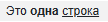

Here is a sample list of supported tags:
 * p
 * ul
 * li
 * div
 * span
 * strong
 * b
 * em
 * cite
 * dfn
 * i
 * big
 * small
 * font
 * blockquote
 * tt
 * a
 * u
 * del
 * s
 * strike
 * sup
 * sub
 * h1
 * h2
 * h3
 * h4
 * h5
 * h6
 * img
 * br

Awesome icons
-------------------

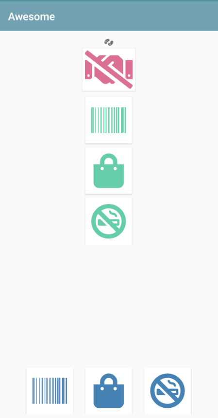

You can use raster icons in the system (files are connected via the Media files section and then used via the ^ prefix). But you can use the Awesome font set. This is a set of icons that you can use to make your own beautiful buttons, make icons on cards, screens, etc. A free set of 1001 icons is used (selection by free + selection by solid) https://fontawesome.com/v5.15/icons?d=gallery&p=2&s=solid&m=free To use, you need to take the Unicode code from the site, for example f6be, and assign it to a variable with the # prefix - i.e. #f6be, which you then specify in the button or caption title. This can be used in screen elements, dialogs, etc. For example:

 * Button
 * List of buttons
 * Horizontal list of buttons
 * Inscription

Simplified markup of input fields with a heading using “|”
---------------------------------------------------------------

All input fields (except the modern input field) can be placed together with the header in a simplified form. How would it be in the standard version? To do this, you need to make a horizontal container and place two elements in it - a Label (field header) and an input field with weights for both = 1. Then we will get a field with a header. The same action can be performed if you simply place an input field:

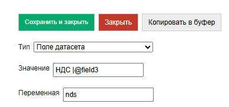

Container Elements
------------------------

Inscription
~~~~~~~~~~~~~~~~

TextView – a text will be output from a variable or constant.

Button
~~~~~~~~~~~~

Button – a simple text button, but with Awesome you can turn it into a button with an icon. When pressed, generates an event with listener=button variable.

Simple input fields
~~~~~~~~~~~~~~~~~~~~~~

Input field string (EditTextText), Input field number (EditText EditTextNumeric), Input field password (EditTextPass), Multiline text (MultilineText) – simple text fields for entering the corresponding data (controlled by the input filter). For a password, the entered text is hidden.

Modern input field
~~~~~~~~~~~~~~~~~~~~~~~~~~

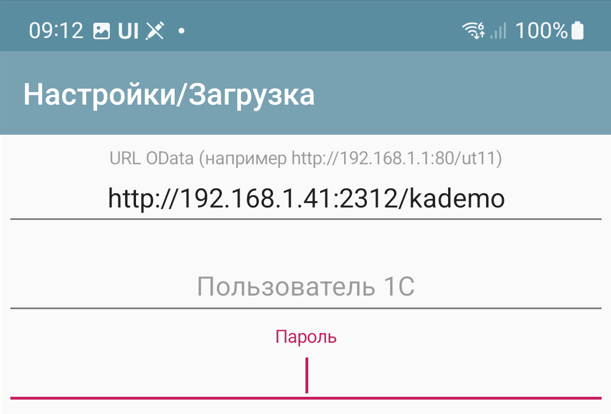

An input field that contains a title/hint depending on whether it is filled in or not. If the field contains information, the hint is shifted to the title area. This way, it is enough to place only one element, which saves space and simplifies development.
The value is specified as JSON. Hint is mandatory. For example

.. code-block:: JSON

 {
 "hint":"Login",
 "default_text":"default_login"
 }

– sets a hint, and if the field should already contain predefined data, then it is set in **default_text** (you can pass not a constant, but a reference to a variable via @)

By default, it is a text field, but you can set any type available on Android via **input_type**. Options are here: https://developer.android.com/reference/android/text/InputType

You can also set **counter** – the counter of entered characters at the bottom and counter_max – the maximum number of characters.

The **events** key can be used to enable event generation with each character entered in the field, for example, to immediately record the entered text in the database. The value must be "true"
Example definition with all possible options:

.. code-block:: JSON

 {
 "hint":"Password",
 "default_text":"default_password",
 "counter":"true",
 "counter_max":15,
 "input_type":145,
 "password":true,
 "events":true,
 }

Input field with event
~~~~~~~~~~~~~~~~~~~~~~~~~~

Input field with event (EditTextAuto) – a text field in which an event is generated and a handler is triggered when each character is entered

Check mark
~~~~~~~~~~~~~

CheckBox – checkbox field with change event (event with listener=variable name is generated). The value is written to the stack variable (variable is defined in Variable) (and is also read from the variable, not from the value). In the Value field – the field title.

Date
~~~~~~~~

Date(DateField) is a field for selecting a date from a calendar. When selecting a date, the date selected by the user, formatted in accordance with the regional settings, is written to the date variable, and the date in ISO format is written to the variable <field_variable>_d. In slices, dates are similarly written in two formats - presentation and ISO.

DatePicker, NumberPicker, TimePicker
~~~~~~~~~~~~~~~~~~~~~~~~~~~~~~~~~~~~~~~

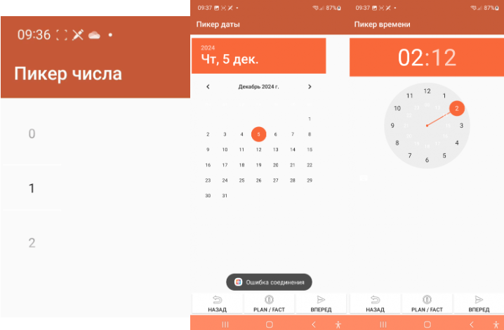

Visual elements for selecting a number, date, time. The selected values ​​are written to a variable. The initial setting is defined in Value.

Format Values ​​for elements:
* Number picker: {"min":0,"max":10,"value":"@number"}, where min/max set the range, value is the set value
* Date picker: {"year":@year,"month":@month,"day":"@day"} - the value is written as a year, month and day
* Time picker: {"hour":@hour,"minute":@minute} – hours, minutes

Picture (see the section "Working with images")
~~~~~~~~~~~~~~~~~~~~~~~~~~~~~~~~~~~~~~~~~~~~~~~~~~~~~~~~~~~~~~~~~

Dropdown list
~~~~~~~~~~~~~~~~~~~~~~~

Drop-down list is a simple drop-down list. Elements can be specified as a string with a separator ";" via a variable or directly in the constructor. The first element in the list will always be selected, so if you want it to be empty by default, the first element should be an empty string or something similar. For example, "<Select a value>;First;Second". The selected value is returned to the Variable. You can specify a default value - the value that will be selected when opening. To do this, you need to put a variable with the name of the result variable on the variable stack. For example, if the variable is res, then put it in hashMap.put("res","Second").

.. note:: Dataset fields are used to select reference objects (see Datasets)

List of buttons vertical and List of buttons horizontal
~~~~~~~~~~~~~~~~~~~~~~~~~~~~~~~~~~~~~~~~~~~~~~~~~~~~~~~~~~~~~

Placement of several buttons using a list. The value is passed a list of button titles, and they are placed in a row vertically or horizontally. When pressed, an event is generated with listener=<button variable> and a variable =button variable with a value equal to the button title is also pushed onto the stack.

Gauge
~~~~~~~~~~~~~~~~~~~

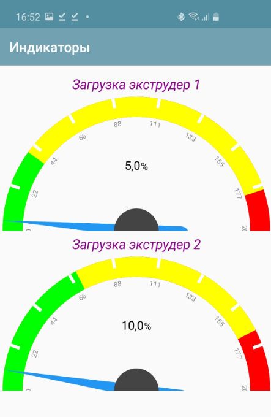

an arrow diagram for visually representing some value

The value is a JSON string with the keys Min (minimum scale value), Max (maximum scale value), Unit (unit of measurement), and Value (current value)

Example:

.. code-block:: Python

 tmenu['gauge_tasks'] = json.dumps({"Min":0,"Max":100,"Value":q,"Unit":" "})

Charts. Line, Bar and Pie charts output to container
~~~~~~~~~~~~~~~~~~~~~~~~~~~~~~~~~~~~~~~~~~~~~~~~~~~~~~~~~~~~~~~~~~~~~~~~~~~~~~~~~~~~~~~~~~~~

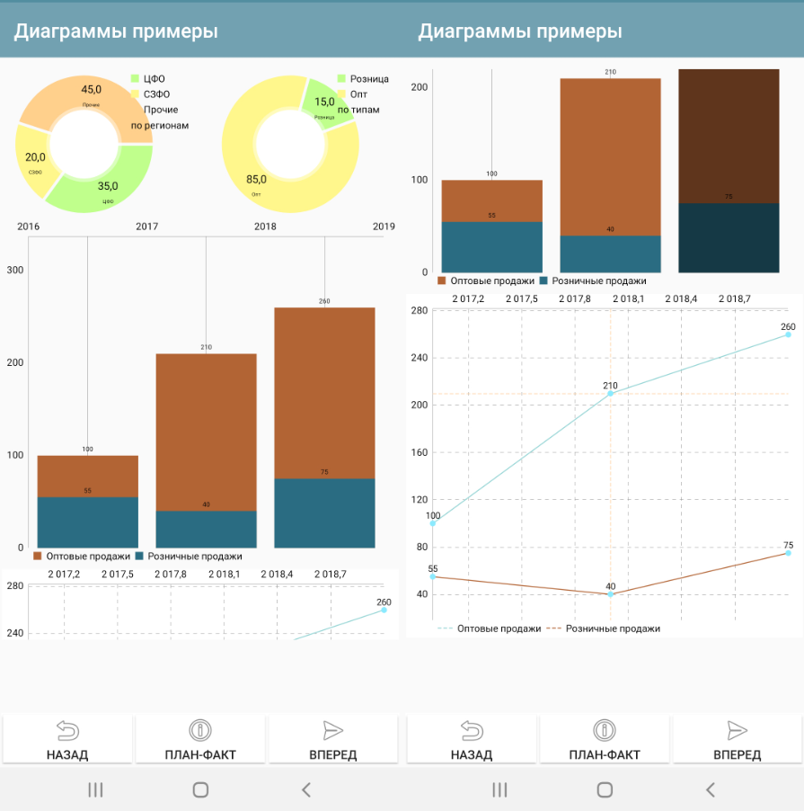

.. note:: By the way, another good way to display charts and reports in general is an HTML field + some library for charts in python. See the HTML field and, for example, an example of connecting the pygal library https://infostart.ru/1c/articles/1760354/

Example Column Chart Values

.. code-block:: JSON

 {"type":"Bar","Datasets":[{"name":"Wholesale","values":[{"x":"2017","y":"100"},{"x":"2018","y":"210"},{"x":"2019","y":"260"}]},{"name":"Retail","values":[{"x":"2017","y":"55"},{"x":"2018","y":"40"},{"x":"2019","y":"75"}]}]}

Example Line Chart Values

.. code-block:: JSON

 {"type":"Line","Datasets":[{"name":"Wholesale","values":[{"x":"2017","y":"100"},{"x":"2018","y":"210"},{"x":"2019","y":"260"}]},{"name":"Retail","values":[{"x":"2017","y":"55"},{"x":"2018","y":"40"},{"x":"2019","y":"75"}]}]}

Example of Pie Chart Values

.. code-block:: JSON

 {"type":"Pie","dataset_name":"by region","PieDataset":[{"value":35,"caption":"Central Federal District"},{"value":20,"caption":"Northwestern Federal District"},{"value":45,"caption":"Other"}]}

Table and List of Cards
~~~~~~~~~~~~~~~~~~~~~~~~~~~~~

The table and the list of cards differ only in design and value format. In essence, they are the same element with the same properties and behavior.

The table does not have row borders by default, they must be specified in the container if required. The same with interlaced layout.

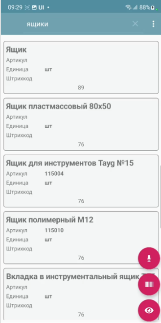

In the Card List, items are formatted as cards.

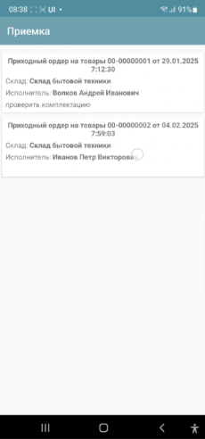

There are several approaches to determining the meaning of these lists, so we will specify a universal format

For a list of cards, the variable will have the structure:

.. code-block:: JSON

 { "customcards":{
            "options":OPTIONS,
            "layout": CONTAINER,
            "cardsdata": DATASET
            }
 }

For the table:

.. code-block:: JSON

 { "customtable":{
             "options":OPTIONS,
             "layout": CONTAINER,
             "tabledata": DATASET
             }
 }

Where:

**OPTIONS** (optional) – an object with a different set of options:

 * **search_enabled**, boolean – search in the toolbar. For objects without a dataset mechanism, this is a search by string entry in all search fields. For datasets, the search is customizable, see Datasets.
 * **save_position**, boolean – save position when redrawing. For example, when updating a row. Works only for lists with a finite dataset. Does not currently work when using portion replenishment.
 * **override_search**, boolean – override search in the toolbar. There will be a search string, but when entering, no search will be performed, but an input event with the variable "SearchString" and listener=Search will be generated. In this case, the developer himself filters the list
 * **search_submit** – search/event generation is performed not after each entered character, but after confirmation of input on the keyboard
 * **colorizing** use selective coloring of elements (see below)
 * **horizontal** – horizontal direction of the list

**CONTAINER** – either JSON with container text (text can be copied, for example, from the constructor) directly (which is inconvenient and cumbersome), or a link to a container defined in the configuration via the ^ symbol. For example, "layout": "^item1" (see example below)

**DATASET** – either a JSON array or a link to a dataset (dataset mechanism) via the ~ prefix. In both cases, the data is an array of JSON objects, one for each list element. In which the variables displayed in the container (via @) are listed. Any others (not displayed in the interface) can also be added.
You can also specify a key separately in the dataset element – ​​a key that is returned when clicked in a special variable (in the case of the dataset mechanism, this does not make sense, since each entry in the dataset has an _id)

Example of defining a list of cards in Python (without using the dataset mechanism, with search options in the toolbar and saving the position)

.. code-block:: Python

 j = { "customcards": {
 "options":{
           "search_enabled":True,
           "save_position":True
         },
         "layout": "^card1",
                             "cardsdata":[]}
 }

 j["customcards"]["cardsdata"].append({"text1":"Some heading 1","text2":"Subheading #1"})
 j["customcards"]["cardsdata"].append({"text1":"Some heading 2","text2":"Subheading #2"})

 hashMap.put("cards",json_to_str(j))

Example of a Table using datasets, without options:

.. code-block:: Python

 j = { "customtable": {
          "layout": "^item",
          "tabledata":"~goods"}
 }

When you click on a list item, a CardsClick event is generated. The following appears in the variables:

 * **selected_card_key** – key, if, and the records have key
 * **selected_card_position** – list position
 * **selected_card_data** (if it is a dataset, or if not a dataset, then if the "return_selected_data" flag is enabled in advance) – the entire record as a JSON array element

Overriding the layout of any list item
""""""""""""""""""""""""""""""""""""""""""""""""""

Since release 10.35, you can make your own design for any customcards and customtable element based on a separate container (for example, highlight it with color), of absolutely any content. To do this, in rows in a specific element, you need to use _layout and pass the desired layout there. Thus, you can make each element with its own design.

.. code-block:: Python

 j = { "customtable": {
          "layout": "^card1",
                              "tabledata":[]}
 }

 j["customtable"]["tabledata"].append({"text1":"Some heading 1","text2":"Subheading #1"})
 j["customtable"]["tabledata"].append({"_layout":"^card2","text1":"Some heading 2","text2":"Subheading #2"})
 j["customtable"]["tabledata"].append({"text1":"Some heading 3","text2":"Subheading #3"})

 hashMap.put("cards",json_to_str(j))

Selective coloring of list items
""""""""""""""""""""""""""""""""""""""""

In lists, you can make an arbitrary layout for each element (via "_layout"), including coloring, but this is an expensive technology (it affects performance on large lists and slow devices). Therefore, just "coloring" has been added (only the background color changes, not the entire layout)

In the table options, **"colorizing"** must be enabled, and then the **_backgroung** property can be used on elements with a color specified in HEX format.

Using Active Items in Lists
""""""""""""""""""""""""""""""""""""""""""""

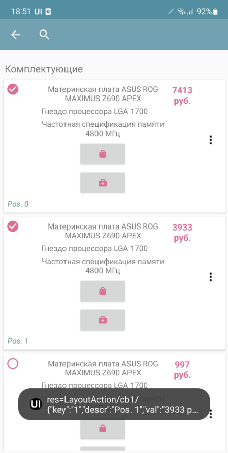

Active elements can be used in list items: Buttons, Menus, and Checkboxes. To do this, they need to be placed in a container in any quantity and in any place. When clicked, they will generate an event with **listener=LayoutAction** separate from clicking on the card itself, and the **layout_listener** and card_data variables are also placed. The first contains the variable of the element that generated the event (button, menu item, checkbox). The second contains the card data, including the position as a JSON string. To add a menu, you need to place the **PopupMenuButton** element in the container, and pass a list of menu items separated by semicolons as the value. For example, "First;Second"
The checkbox behaves like a normal checkbox, plus it performs the required action - when the state changes, it writes the state value to the list variable dataset so that the current state is shown when the list is updated.

Using Search, Redefining Search
"""""""""""""""""""""""""""""""""""""""""""""""""""

.. note:: For datasets, the search is organized differently. See the chapter "Datasets".

In order for automatic search by table in the toolbar to appear on the screen, it is necessary to add the **search_enabled** field with the value True to the JSON list in the "options" section. Also, if desired, you can pass the field by which the search will be conducted **search_string** - this is the key in which you can place a string with search data for each card. The search will be conducted by the inclusion of the search substring in this string. If there is no such field in the card, then the search will be conducted by all fields of the data object. This search can be overridden - to send the entered text to events. To do this, you need to add **override_search** with the value True to the "options" section, then when entering text in the search field, the **Search** event will be generated, and the entered text will go to the **SearchString** variable

Horizontal lists
""""""""""""""""""""""""

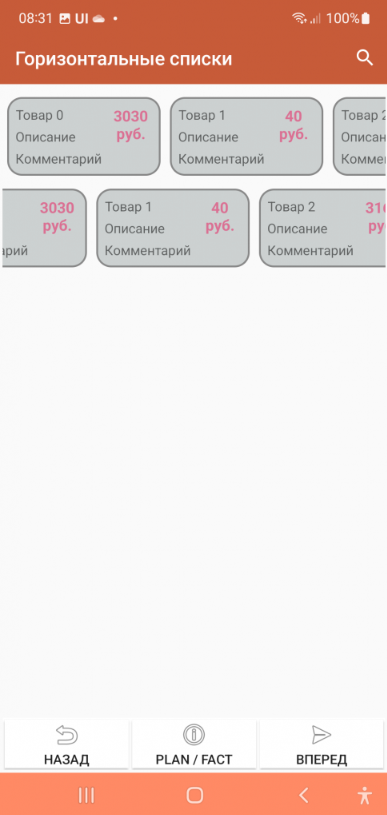

The **horizontal**:True option makes the list horizontal. Also, if you want the card to be not the full width of the screen, but, say, some part of it, you need to specify the "width_ratio" option - with a percentage of the screen width, for example, 50 - will be half the screen. If you do not specify it, the card will be the full width.

Save position in the list
"""""""""""""""""""""""""""""

In order for automatic search by table in the toolbar to appear on the screen, it is necessary to add the field "save_position" with the value True to the JSON of the list in the "options" section. When the event occurs and the list is redrawn, the list will remain in the same place.

Using groups
""""""""""""""""""""""""

You can group a list of cards (works only with a list of cards). To do this, you need to insert objects with the "group" field (a predefined field) in the right places in the dataset

Loading additional data when scrolling
"""""""""""""""""""""""""""""""

For large lists, you can do additional loading - receiving portions of data when the user has scrolled to the end. When scrolling further, the LoadMoreItems event occurs, decorated with a progress bar, in which the developer can define a handler for adding a new portion of lines to the AdditionalItemsData variable.

Positioning to a position in the card list and table
"""""""""""""""""""""""""""""""""""""""""""""""""""""""""""

Now you can instantly or smoothly move to the selected position with two simple commands:

* **ListGoTo**, position number – instant move to position
* **ListGoToSmooth**, position number – animated move to position

Dataset fields
~~~~~~~~~~~~~~~~~~

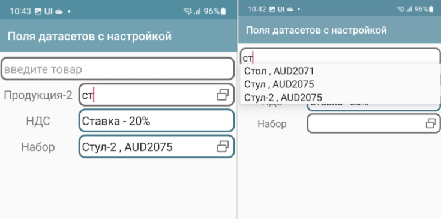

You can place reference data entry fields on the screen that contain links to dataset records.
 
You simply specify a variable in which the field value is or will be stored as a link and the dataset in the value. That's all. The user simply selects a record from the list, uses the search if necessary. When selecting, a universal link also gets into the variable.

For such a case, it is advisable to define 2 things in the dataset options:

* Post view – view_template option. You can use html. Field names are specified in curly brackets. You can place several fields in the view. For example, {name}, {barcode}. You can use html. For example, {name}:{article}
* You can specify the shape of the list elements list_layout – container name (default is AUTO)

Example of creating and specifying dataset options:

.. code-block:: Python

 datasrv = CreateDataSet("goods")
 datasrv.setOptions(json_to_str({"list_layout":"item","view_template":"{name} , <b>{article}</b>"}))

You can use the | construct to place a field with a title
 

To set the field settings, there is a simplified version and a version with settings. The simplified version is given above, and for settings, you need to specify JSON settings (usually via a variable)

 * dataset (required) – dataset name
 * inline – search by string directly in the field
 * select – button to select from the list
 * spinner – selection from a list (analogous to a drop-down list) replaces the inline option
 * hint - hint
 

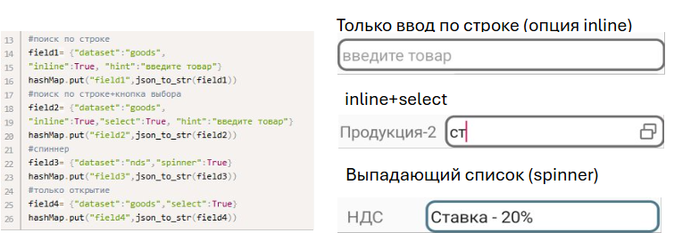

Selected and preset values
""""""""""""""""""""""""""""""""""""""""""

The universal reference is used everywhere - both as a result of user selection and for setting predefined values.

For example, let's create a dataset nds

.. code-block:: Python

 datasrv = CreateDataSet("nds")
 datasrv.setOptions(json_to_str({"view_template":"Rate - {name}"}))
 
 nds_list = []
 nds_list .append({"name":"10%","_id":"VAT10"})
 nds_list .append({"name":"20%","_id":"VAT20"})
 nds_list .append({"name":"0%","_id":"VAT0"})
 datasrv.put(json_to_str(nds_list))

And on the screen in onStart we will set the VAT by default

.. code-block:: Python

 hashMap.put("nds","nds$VAT20")

Then, when you open it, you will see the result:
 

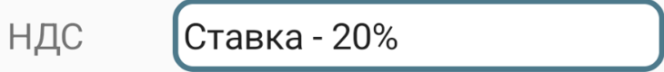

ActiveCV
~~~~~~~~~~~

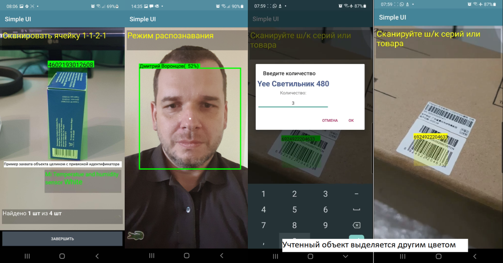

CV capabilities are discussed in detail in the ActiveCV section

Map field
-------------

Vector maps are discussed in detail in the Vector Editor section.

HTML field
~~~~~~~~~~~~~

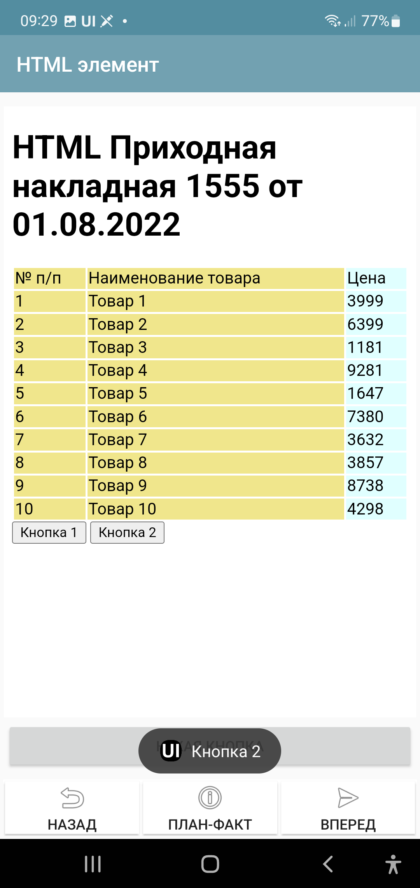

.. note:: This section is about the HTML screen element, but for the most part this is also true for the PrintPreview command which opens an HTML field for previewing and printing.

You can place an HTML field on the screen. You need to pass an HTML document to the value, then it will be displayed as HTML.

This element also contains Javascript support and can execute scripts in the document. Communication with the Android application (event generation in SimpleUI) occurs through the onInput function.

Example of implementation of button handlers.

.. code-block:: HTML

 <input type="button" onclick="callJS('Button 1')" value="Button 1">
 <input type="button" onclick="callJS('Button 2')" value="Button 2">
  
 

For HTML preparation, you can use, for example, the Jinja template engine. More information about development techniques is written here https://infostart.ru/1c/articles/1760354/

By the way, layout files do not necessarily need to be stored as strings in handlers, Media files are quite suitable for this purpose. You can attach several layouts to the configuration and use them.

Custom Screen Markup (XML Markup)
-----------------------------------------------

An alternative to the constructor and containers is arbitrary screen layout, in the form in which it exists in native development. With the appropriate tools for work. Described in detail in the article https://infostart.ru/1c/articles/1983895/

