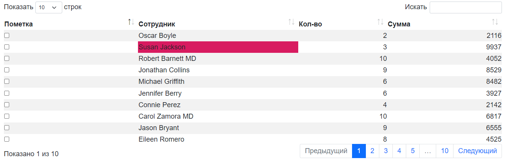
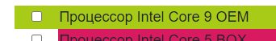
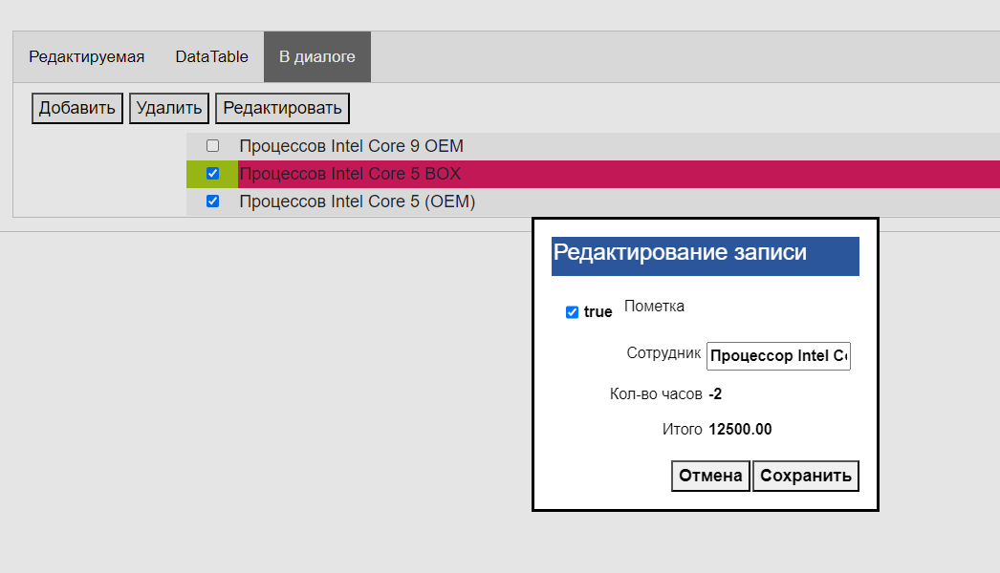
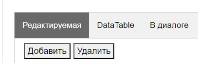
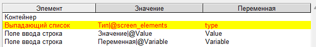
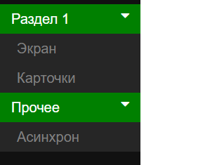

.. SimpleUI documentation master file, created by
   sphinx-quickstart on Sat May 16 14:23:51 2020.
   You can adapt this file completely to your liking, but it should at least
   contain the root `toctree` directive.

SimpleWEB
=======================

**SimpleWEB** is a solution for creating desktop, web fronts, web applications on the Simple semantics. Unlike SimpleUI, which is designed only for Android, SimpleWEB covers all other niches of front-end solutions - fronts for cloud solutions, for client-server solutions, external fronts for ERP, etc.

SimpleWEB is technically a Python library (uiweb) that can read configurations in Simple semantics (ui files) and create web applications that can be deployed on a local network or at any hosting provider that supports Python. At the same time, the web application uses web sockets to ensure high performance and responsiveness of the interface and implement deeper asynchronous and diverse interactions via sockets (direct interaction with the client from the server). During operation, the library generates pure html + CSS + JS / JQuery code and inserts it dynamically, i.e. interface elements, event handlers - all this is created on the fly, addressably.

The web application consists of a startup application (e.g. app.py), which calls the uiweb library and serves a web server (e.g. Flask), has some auxiliary methods (e.g. file upload/download commands, redirect to the settings page). The library, in turn, accesses the configuration (``*.ui``) and the handler file, which are specified in the settings via the administration panel (http://localhost:1555/admin). In fact, after loading via the administration panel, the configuration and handler file are copied to the current_configuration.ui and current_handlers.py files in the application folder, and then the library works with them directly. Thus, debugging and editing the code is possible directly in current_handlers.py (after which the changes can be transferred to an external file). Editing the configuration in development mode is also easier to do directly in current_configuration.ui so that the changes are committed immediately to the web application.

To install you need:
 
1. Download the folder with the app.py startup script from GitHub and deploy it where it will be launched: https://github.com/dvdocumentation/simpleweb
2. Install dependencies:

``pip install -r requirements.txt``

and it is advisable to then update the uiweb library itself (which is SimpleWEB:

``pip install uiweb –upgrade``

3. Run the app.py application:

``python3 app.py``

4. The application is available at http://localhost:1555/ after which you can go to the admin panel (http://localhost:1555/admin) and set the configuration (ui file), if necessary, the file with handlers and the path to the web service if there is one. This completes the setup, you can use it.

There is no separate training on SimpleWEB, as it differs little from SimpleUI. To begin with, it is recommended to look at the first_configuration configuration https://github.com/dvdocumentation/simpleweb/tree/main/samples/first_configuration

Features of development in SimpleWEB, compared to SimpleUI and main capabilities.
-------------------------------------------------------------------------------------------

Executing scripts when the page loads
~~~~~~~~~~~~~~~~~~~~~~~~~~~~~~~~~~~~~~~~~~~~

Despite the fact that SimpleWEB has an onLaunch event (which is launched after the session load is complete), it is also possible to embed code directly into the HTML page, the head section. These can be scripts, library connections, anything. And this will be done when the configuration page is loaded (when opened or refreshed in the browser). Available in the online designer, in the "Configuration" section

Tabs
~~~~~~~~~~~~
Since SimpleWEB is a desktop system, the main action takes place inside tabs, unlike SimpleUI where screens are drawn. But it is not enough to simply open a tab - there are also situations, such as reopening the same tab, in which it may be necessary not to create a new tab, but to reopen an existing one and other needs for tab management.

The tab is opened by the **OpenScreen** command, in which you can pass the process and the screen from which the screen will be taken for the new tab:

**OpenScreen**, parameters {"process":<process> screen":<screen>, ["key":<key>], ["reopen":true|false], ["no_close":true|false]}

There are also optional parameters:

**key** (optional) – you can specify a unique tab key (for example, the document's uid or the name of the operation) by which the system will understand that such a tab is already open. Tabs from the main menu are automatically created with key = process name
 
**reopen** (optional) – if set to true and then resend OpenScreen with the same key, then instead of a new tab, the previously opened one will be reopened/updated. This is convenient, because you don’t have to think about how to find an already opened one, so as not to create new tabs
 
**no_close** (optional) – prohibits manual closing of the tab (the cross is removed)

You can close a tab (in addition to manually closing it) using the **CloseTab** command:

**CloseTab**, with an empty parameter – closes the current tab. In the new version, the previous tab becomes active.

**CloseTab**, <key> - closes a tab with a specific key from the pool of open tabs

You can switch to an open tab from code using **SelectTab**:

**SelectTab**, <key>

Lock/unlock the entire tab bar:
	
**BlockTabs** – block all tabs from the user

**UnblockTabs** – unblock tabs

Tracks the event of the user selecting a tab.
"""""""""""""""""""""""""""""""""""""""""""""""""""

When the user selects one of the open tabs, the general event **onWEBMainTabSelected** is fired.

The CurrentTabKey variable is pushed onto the variable stack, containing the key of the open tab and CurrentTabID with the internal ID of the open tab. listener = MainTabSelect

Other functions for working with screens and screen elements
~~~~~~~~~~~~~~~~~~~~~~~~~~~~~~~~~~~~~~~~~~~~~~~~~~~~~~~~~~~~~

**RefreshScreen** , without parameter – refreshes the current screen. In SimpleWEB, refreshing does not happen automatically after an input event, it must be started when necessary, or using the SetValues, SetShow, etc. commands.

**ShowScreen**, screen name or {"process":<process>,"screen":<screen>} – displays the specified screen on the current tab. The screen is specified either by simply specifying the screen (from the current process) or as JSON specifying the process and screen.

**Show_<variable>**,<visibility: "-1","0","1"> - control of element visibility similar to the command in SimpleUI. The variable of the element is passed in the ``Show_`` key, the visibility mode is hidden/invisible/visible - "-1"/"0"/"1" in the parameter

**SetShow_<variable>**,<visibility: "-1","0","1"> - visibility control, similar to ``Show_`` but with the difference that the change occurs not after the screen is updated, but instantly

Instantly update values ​​without refreshing the screen
~~~~~~~~~~~~~~~~~~~~~~~~~~~~~~~~~~~~~~~~~~~~~~~~~~~~~~~~~~~~~

Values ​​can be re-read when the tab/screen is refreshed, but they can also be sent from the server directly to the element (via web sockets):

Parameters are passed as a JSON array:

[<variable>:<new value>]

**SetValues** – replaces text values ​​(eg labels)

**SetVauesPulse** – Replaces text values ​​with a fading highlight effect

**SetValuesTable** – updates the table

**SetValuesEdit** – updates the input field (text in the input field)

**SetValuesCards** – updates the list of cards

**SetValuesHTML** – replaces the HTML of the element with the specified variable with your HTML

Dialogues
~~~~~~~~~~~~~

Supported (syntax is similar to SimpleUI: https://uitxt.readthedocs.io/ru/latest/common_functions.html#id24 ):

* ShowDialog
* ShowDialogStyle
* ShowDialogLayout

When using ShowDialogLayout , the input elements' data is placed in the **dialog_values** JSON dictionary.
SimpleWEB also has the option to assign some dialog elements as event sources. This is done with the command:

**ShowDialogActive**, <list of variable elements separated by ;> - designates some dialog elements as "active" - ​​an event with listener=<variable name> will be generated for them.

Files
~~~~~~~~~~~

Uploading files.
"""""""""""""""""""

**UploadFile**, [<id>] – command that initiates the upload dialog, you can pass id
To load, the application module must have a function that looks something like this:

.. code-block:: Python

  @fapp.route('/upload_file', methods = ['PUT', 'POST'])
  def upload_file_ui():
     file = request.files['file']
     if file.filename == '':
              #'No selected file'
              return redirect(request.url)
     if file:
            filename = request.args.get('sid')+"_"+secure_filename(file.filename)
            os.makedirs(PYTHONPATH+os.sep+fapp.config['UPLOAD_FOLDER'],exist_ok=True)
            file.save(PYTHONPATH+os.sep+os.path.join(fapp.config['UPLOAD_FOLDER'], filename))

            user = get_current_connection(request.args.get('sid'))
            user[2].input_event({"data":"upload_file","filename":filename,"source":request.args.get('id')})

After uploading, an event listener = 'upload_file' is raised with the variable 'filename', which stores the path to the file

File field on the dialog form
"""""""""""""""""""""""""""""

To upload a file, for example, as part of a Dialog with content, you can place the File field in a container. After selecting a file, its content in base64 format is placed in the variable 'base64'

Downloading a file via the link on the screen
"""""""""""""""""""""""""""""""""""""""""

To do this you need:

1. Place a function of this type:

.. code-block:: Python
 
 @fapp.route('/download_file', methods = ['GET', 'POST'])
 def download_file():
     os.makedirs(PYTHONPATH+os.sep+fapp.config['UPLOAD_FOLDER'],exist_ok=True)
     filename = request.args.get('filename')
     return send_from_directory(PYTHONPATH+os.sep+os.path.join(fapp.config['UPLOAD_FOLDER']), filename, as_attachment=True)

2. Make the link of the inscription look like this:

``'You can download the file here: <a href="/download_file?filename='+Path(filename).name+'" target="_blank">download</a>'``

Working with the clipboard
~~~~~~~~~~~~~~~~~~~~~~~~~~~~~~~~

Writing text to the clipboard
"""""""""""""""""""""""""""""""""""""

**WriteClipboard**,<text> - copies text to the clipboard. For all browsers.

Reading text from the current clipboard
"""""""""""""""""""""""""""""""""""""""""""

**ReadClipboard**, without parameter - reads the clipboard, places it in **clipboard_result** and calls the listener=clipboard_result event. Works on Chrome either in https or localhost.

Working with cookies
~~~~~~~~~~~~~~~~~~~~~~~~

**SetCookie**, [{"key":<key>,"value":<value>,"expires":<number of days>}] - sets an array of cookie values ​​for the current site on the current computer. expires (expires time in days) can be omitted.
**GetCookies** - get all previously set cookie values

Tables
~~~~~~~~~~

Tables of type *table* are available with a description similar to https://uitxt.readthedocs.io/ru/latest/common_functions.html#id2

There are differences in the web version:

1. In addition to **TableClick**, **TableDoubleClick** is also available – a separate event for double-clicking the mouse
2. It is possible to use automatic sorting, pagination, search by fields using the DataTable component. To do this, use the useDatatable: true option.

3. Editing is available directly in the table. To do this, set the "editmode" mode in the header: **"table"** and in the fields in which editing is required, specify the type of element to edit in the **"input"** field:

  * "input":"CheckBox"
  * "input":"EditTextText"
  * "input":"EditTextNumeric"

As a result, after editing, the **TableEdit** event will occur with the available variables **selected_line**, **table_column**, **table_value**

4. It is possible to create handlers for simplified adding/editing of records in the form of mobile windows, which are automatically generated by table fields. To do this, you need to:

	1. In the table, specify "editmode": "modal"
	
	2. Specify the type of editing element in the "input" field:

		"input":"CheckBox"
		"input":"EditTextText"
		"input":"EditTextNumeric"
	
	3. Put buttons in the handlers of which the commands TableAddRow, <table name> and TableEditRow, <table name> are generated. These buttons will launch the dialogs. It is more logical to assign TableEditRow to a double click, for example
	
	4. Based on the input result, a TableEditModal event is generated in the mobile dialog, in which the **table_values** and **selected_line** variables are available.
                    

Card lists
~~~~~~~~~~~~~~~~~

Card lists have similar functionality, including placement of active elements to customcards lists: https://uitxt.readthedocs.io/ru/latest/common_functions.html#id4

Bookmarks inside the screen
~~~~~~~~~~~~~~~~~~~~~~~~~~~~~~~

As container elements, you can use bookmark sets "Bookmarks", consisting of a container of the type "Bookmark"

The **SelectTab**, <bookmark variable> command can be used for internal tabs to select the current tab

Login
~~~~~~~~

It is possible to use the "Run at startup" process flag - then when the configuration page is loaded, the selected process will be launched, while the rest of the process menu will not be loaded, thereby blocking access to other processes (only the login process is available).
If the login is successful (for example, password verification), you need to call the **LoginCommit** command so that the main menu loads in normal mode and you can continue working with the configuration

Asynchronous handlers
~~~~~~~~~~~~~~~~~~~~~~~~~~~

Asynchronous handlers return the result to the tab from which they were launched.

Design styles
~~~~~~~~~~~~~~~~~~~~~

Elements can be styled in CSS (via style elements). This way, you can access any element design. In the style element, you need to enable the "Use as class" checkbox and fill in the CSS field.

Notifications, toasts, sounds
~~~~~~~~~~~~~~~~~~~~~~~~~~~~~~

**toast**, <message text> - pop-up notification, can be specified in HTML form

**basic_notification**, {"message":<message>,"title":<title>} – notification in a separate window with a title

**beep**, empty parameter – play sound

Simplified definition of input fields
~~~~~~~~~~~~~~~~~~~~~~~~~~~~~~~~~~~~~~~

To specify a structure in the form of "Input field header" - "Input field", instead of a horizontal container, caption and input field for a field of the type "Text input field", "String input field", "Autofill input field", "Drop-down list" and similar, you can define a format structure:

<Field title>|@<default value>

Or for lists:

<field header>|@<list variable>

Extended work with menus.
~~~~~~~~~~~~~~~~~~~~~~~~~~~~~~~

By default, the menu is generated based on the list of processes (except for the processes "Do not show in menu", "Run at startup"). You can also group the menu by sections. To do this, you need to specify the menu structure in the Menu Template field, for example in this format:

[{"caption":<section title>,"elements":[{"caption":<process title>,"process":<process name>}]}]

For example:

[{"caption":"Section 1","elements":[{"caption":"Screen","process":"screen"},{"caption":"card list","process":"card list"}]},{"caption":"Other","elements":[{"caption":"Async","process":"Async"}]}]

Features of working with the HTML field
~~~~~~~~~~~~~~~~~~~~~~~~~~~~~~~~~~~~~~~~~~~~~~

The HTML field allows you to place any of your HTML code with scripts, styles, etc. in the container. An example is suitable, for example, from https://infostart.ru/1c/articles/1716745/ (invoice)
The peculiarity is that if you want a click on an element to be processed in a standard way, for example on a button, then you need to specify an id starting with a hash:

``<button id="#btn_1" style="text-align: center;;margin: 3px">Button 1</button>``

But, you can also call, for example, your own function, which will work in your JS script.

Barcodes
~~~~~~~~~~~~~

It is possible to connect a barcode scanner on the client in the "keyboard break" mode, emulation of keys. Recognition is carried out on the principle of determining fast input (generation of keys from the scanner occurs quickly, the delay is less than 1 second). The barcode event is generated, which is processed on the same principle as in SimpleUI

List of common events supported by SimpleWeb
-------------------------------------------------------

 * onLaunch - event when loading the configuration
 * onWEBMainTabSelected - event when a tab is activated

List of supported container visuals
-------------------------------------------------------

 * Bookmarks, bookmark
 * Container
 * Inscription
 * Text input field
 * Autofill field
 * Input field number
 * Password input field
 * Multiline text
 * File
 * Date input field
 * Drop-down list
 * Check mark
 * Button
 * Picture
 * Table
 * List of cards
 * HTML field
