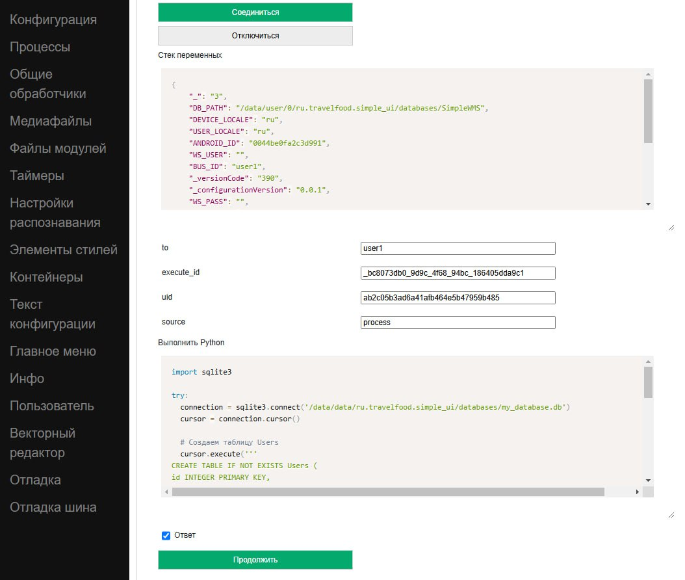

.. SimpleUI documentation master file, created by
   sphinx-quickstart on Sat May 16 14:23:51 2020.
   You can adapt this file completely to your liking, but it should at least
   contain the root `toctree` directive.

Storing data on the device (key/value, NoSQL, SQL)
========================================================

Recommended approaches to storage
------------------------------------------

The current and recommended storage configuration involves using the following tools for local storage, depending on the nature of the data and the intended use case (these tools can be combined):

* **datasets** resident in memory with the ability to save/load locally for storing **external systems** data – reference books, links, etc. Due to deep integration into configuration mechanisms, development is greatly simplified, and performance is the highest
* A **key/value** database for storing **simple data** – such as application settings, constants, input values, screen contents
* **NoSQL Pelican** for **own data and all other tasks**. This is a JSON-oriented DBMS, developed specifically for Simple, which in principle in terms of functionality can of course replace the two previous points, but datasets have a trump card in the form of powerful integration into mechanisms, and key/value is simpler for situations when you just need to put/read a value of the constant type

Datasets
~~~~~~~~~~~~~~~~~~~~

Description is being prepared…

"Key/Value"
~~~~~~~~~~~~~~~~~~~~~~

Key value in python handlers (pythonscript, python, pythonargs)
"""""""""""""""""""""""""""""""""""""""""""""""""""""""""""""""""""""""""""

The database can store the following values:
 * Simple types (string, number, boolean)
 * Dictionary and list (dict and list) without prior conversion
 * Java data types such as hashMap without conversion

The data is stored in the DB for each configuration separately (i.e. divided by configuration uids). To access functions in the android module, the **_local** object is used (in pythonscript it is already imported from android) with the following methods:
 * **put(<key>,<value>)** – save the value
 * **get(<key>)** – get value
 * **delete(<key>)** – delete a key
 * **destroy()** – delete the entire configuration database
 * **keys()** – get all configuration keys as a list

Examples (for pythonscript _local is already imported)

.. code-block:: Python

  
 #it ​​is possible to save primitive types
 _local.put("my","hello")
 _local.put("number",25.4)
 _local.put("setting1",True)
   
 #you can save dict and list
 my_object = {"name":"Jhon"}
 _local.put("j2",my_object)
   
 #you can save the variable stack
 _local.put("map",hashMap)
   
 #getting values
 toast(_local.get("my"))
 #get all keys
 keys = _local.keys()
 toast("Total keys:"+str(len(keys)))
 #object receiving
 j = _local.get("j2")
 if not j==None:
  	toast(str(j["name"]))

Key-value in javascript handlers
""""""""""""""""""""""""""""""""""""""""""""

Primitive types are available for storage (JSON will have to be converted to a string and back)

Available commands:
 * NoSQLPut(String database, String key,String value) – put the value into the specified database
 * NoSQLGet(String database, String key) – get value
 * NoSQLDelete(String database, String key) – delete value
 * NoSQLGetAllKeys(String database) – get array of keys

Example:

.. code-block:: JavaScript

 //Saving
 android.NoSQLPut("my_book","val1",hashMap.val1);
 android.toast("Saved");
 //Getting
 var val1=android.NoSQLGet("my_book","val1");
 if(val1==null){
 val1="";
 };
 android.toast(val1);

Full examples can be found here: https://github.com/dvdocumentation/simpleui_samples/tree/main/javascript

Key-value via variable stack
""""""""""""""""""""""""""""""""""""""""

It should be noted that when working through the stack, commands are executed at the end of the cycle, i.e. a command to get data from storage will not return data to a variable in the same handler (an additional event is required). Also, since stack variables are of the string type, only work with strings is available.

 * **(put_key, variable)** - write data to the DBMS in the key
 * **(get_key, variable)** - get data from the DBMS from the key to the variable. If the handler contains get_ commands, the system extracts data from the DBMS to Variables, after which it calls the "_results" event (like a new handler cycle)
 * **(del_key,)** - delete key
 * **(getallkeys, variable)** - get a list of all keys

JSON-oriented NoSQL Pelican
~~~~~~~~~~~~~~~~~~~~~~~~~~~~~~~~~~~~~

Pelican is an open source project of a serverless JSON-oriented DBMS on Python created specifically for the Simple ecosystem. This is the simplest way to work with local storage - essentially pure JSON, in Python these are dictionaries and lists. The syntax is completely the same as in MongoDB and the previously created SimpleBase DBMS https://simplebase.readthedocs.io/en/latest/ . That is, we can say that this is a local, serverless analogue of MongoDB on the device. Due to the special architecture of working with data, it was possible to achieve speed indicators comparable to SQL and independent of the size of the collection in critical areas: adding / changing (upsert / update) / deleting data, index search, text search.

Pelican Properties:

 * Instantly add new records/modify/delete records **regardless of collection size** thanks to special storage architecture.
 * Faster operations due to not having to encode/decode the entire collection (which can be very large)
 * Versioning of objects
 * Collections are always stored in memory with change tracking enabled: data is re-read from disk only if it has been changed by another process.
 * ACID for multi-user and multi-threaded operation
 * Two types of indexes for key query types - a hash index and a special B-tree for full-text search.
 * Support for transactions (sessions)

GitHub of the project https://github.com/dvdocumentation/pelican_dbms

Use in SimpleUI and other systems
"""""""""""""""""""""""""""""""""""""""""""""""

Since Pelican is a python library, in general (except for SimpleUI) it requires installation and then import

``pip install pelicandbms``

further:

.. code-block:: Python

 from pelicandb import Pelican
 db = Pelican("samples_db1") #optionally you can specify the path, work only in memory (RAM), work only with one thread (singleton)

But, in SimpleUI, since this is a mobile application Pelican is already built in and there are special mechanisms to speed up the work. They consist in the fact that the database initialization parameters (the array of databases that the configuration uses) with settings are specified in the configuration and this process (and it can be long) is launched when the configuration starts in a separate thread so as not to slow down the loading. At the output of this process, a stack of pelicans instances is obtained, which can be accessed as a database, without wasting time on initialization, loading indexes, etc., i.e. by accessing this stack, we get a ready-made database instance

Initialization settings are specified in the Pelican initialization field (in Configuration)

.. image:: _static/pelican_init.PNG
       :scale: 100%
       :align: center

Here you need to specify the database settings as a JSON array in the form of objects with the following keys:
 * **database** – DBMS name
 * **initialize** (optional) – if True then the database will be initialized when the configuration starts
 * **RAM** (optional) – if True then the database will be stored only in RAM
 * **singleton** (optional) – will not check whether the data has been modified by another process, which speeds up data writing
 * **data_folder** (optional) – the database will be placed in the Data folder of the configuration
 * **reindex_hash** (optional) – an array of objects of the form [{<collection name>:<key name>}] for creating hash indexes
 * **reindex_text** (optional) – an array of objects of the form [{<collection name>:<key name>}] to create B-tree indexes for text search

Then the access to the databases in the handlers will be like this

.. code-block:: Python

 from pelican import pelicans
 db = pelicans['test'] #get a ready-to-use DB anywhere

.. note:: It should be taken into account that initialization, even if it takes a few milliseconds, is not instantaneous, so if you want to work with pelicans in onLaunch, you should understand that onLaunch is performed in the main thread, and initialization is in parallel, so you should either wait (start an infinite loop waiting for the key-base in the pelicans dictionary) or (the best solution) execute your code after initialization. To do this, during and after initialization, several common events occur in the system:

 * **onPelicanInitAction** – the variables PelicanInitDatabase and PelicanInitAction are available – an event for each database from the initialization list and for each step. For example, you can display notifications about this
 * **onPelicanInitialized** – event when all initialization is completed
 * **onPelicanInitError** – error during initialization

A small example of working with the Pelican library (the full version of examples for all occasions is here https://github.com/dvdocumentation/pelican_dbms/blob/main/samples_pelican_ru.py)

.. code-block:: Python

 from pelicandb import Pelican,DBSession,feed
 import os
 from pathlib import Path
 import os
  
 """
 Basic examples: CRUD operations without transactions, indexes
 """
 #Initialize DB (general case), path= path to DB directory
 db = Pelican("samples_db1",path=os.path.dirname(Path(__file__).parent))
 #or initialization in SimpleUI via pelicans stack
 #from pelican import pelicans
 #a = pelicans[' samples_db1']
 
 #adding a document without ID
 id = db["goods"].insert({"name":"Banana"})
 print("Added:",id,sep=" ")
   
 #adding a document with ID
 try:
      id = db["goods"].insert({"name":"Banana", "_id":"1"})
 except:
      print("Such document already exists")    
 
 #Upsert document
 db["goods"].insert({"name":"Peach", "price":100, "_id":"2"}, upsert=True)
 db["goods"].insert({"name":"Peach", "price":99, "_id":"2"}, upsert=True)
   
 #Adding a set
 ids = db["goods"].insert([{"name":"Apple", "price":60}, {"name":"Pear", "price":70}], upsert=True)
 print("Added:",ids,sep=" ")
   
 #All documents of the collection
 result = db["goods"].all()
 print(result)
 
 #Get by id
 result = db["goods"].get("2")
 print(result)
   
 #same thing via find
 result = db["goods"].find({"_id":"2"})
 print(result)
   
 #Get a specific version of a document by id
 result = db["goods"].get_version("2",0)
 print(result)
 
The examples cover all usage scenarios and are best studied from them, but there is also documentation from SimpleBase (which is suitable for Pelican, a separate one for Pelican is not ready yet). In particular, the Queries section (which in turn coincides with that from MongoDB) may be useful https://simplebase.readthedocs.io/en/latest/querys.html

With Pelican you can work:

 * directly from python handlers (via pelicans stack or via class instance)
 * via variable stack (for all non-python handlers)
 * via the feed command (for batch transmission. No description, only examples)

Configuration with examples for SimpleUI is available here: https://github.com/dvdocumentation/simpleui_samples/tree/main/pelican_simpleui

All this and other nuances are described in the video and analyzed using examples here https://youtu.be/aEAzLWPgN2c

Alternative approaches to storage
--------------------------------------------

SQL
~~~~~~

The built-in SQLite is standard for Android. Its advantages are that it is a classic relational DBMS - fast work, SQL queries, aggregation functions. SQL is good for an established architecture with many tables linked by keys. Or, for example, to calculate aggregate functions for large tables, such as balances.

You can create several DBMS within the application. Moreover, it is recommended to work not with the default DBMS, but to create your own.

.. warning:: SQLite on Android feature. SQLite on Android reacts poorly to multi-user connections. And this, for example, can be, for example, work in the background on a schedule and in parallel some writing to the database from the screen. Therefore, a couple of recommendations: 1) use a separate database for your configuration. So at least you will not intersect with the application (which also writes to its SQL) 2) try to access the database (even for reading) through a single connection point (singleton). By default, SimpleUI has a SimpleSQLProvider class that implements this pattern, but you can organize your own.

You can work with SQLite:

 * directly from Python using sqlite3
 * from Python using ORM Pony
 * via variable stack (implemented via SimpleSQLProvider)
 * via singleton class SimpleSQLProvider
 * from javascript handler (implemented via SimpleSQLProvider )

Via sqlite3
""""""""""""""""""

I'll just give an example where the connection string to the database matters. The rest is standard.

.. code-block:: Python

 import sqlite3
 try:
   connection = sqlite3.connect('/data/data/ru.travelfood.simple_ui/databases/my_database.db')
   cursor = connection.cursor()
   
   # Create the Users table
   cursor.execute('''
   CREATE TABLE IF NOT EXISTS Users (
   id INTEGER PRIMARY KEY,
   username TEXT NOT NULL,
   email TEXT NOT NULL,
   age INTEGER
   )
   ''')

   # Save changes and close the connection
   connection.commit()

   # Add a new user
   cursor.execute('INSERT INTO Users (username, email, age) VALUES (?, ?, ?)', ('newuser', ' newuser@example.com ', 28)) 

   # Save changes and close the connection
   connection.commit()
   
   cursor.execute('SELECT * FROM Users')
   users = cursor.fetchall()
   
   res=""
   for user in users:
     res+=str(user)
   
   connection.close()
  
   hashMap.put("result",res)
 except Exception as e:
   toast(str(e))

Through the variable stack
""""""""""""""""""""""""""""""""""""

**SQLConnectDatabase**, database name. Since the database name is specified, it is assumed that several databases can be used, in addition to the default one.

.. code-block:: Python

 hashMap.put("SQLConnectDatabase","test_perform.DB")

**SQLExec**,{"query":<SQL query>,"params":<parameters separated by commas or JSON array>} Executes a query to change the database (all except SELECT), the parameters in the query are specified in an unnamed form, and in params, they are listed separated by commas. Or you can specify the parameters via a JSON array

For example:

.. code-block:: Python

 hashMap.put("SQLExec",json.dumps({"query":"create table IF NOT EXISTS goods (id integer primary key autoincrement,art text, barcode text, nom text)","params":""}))

**SQLExecMany**, {"query":"SQL statement","params":"array of parameters"} – executes a query in BULK mode with an array of multiple records. The query parameters are passed as an array of records in the form of a string – a JSON array

Example:

.. code-block:: Python

  values=[]
  for i in range(1,3):
        record =[]
        record.append("AA"+str(i))
        record.append("22"+str(i))
        record.append("Product via variable "+str(i))
        values.append(record)
   
   
  hashMap.put("SQLExecMany",json.dumps({"query":"insert into goods(art,barcode,nom) values(?,?,?)","params":json.dumps(values,ensure_ascii=False)}))

**SQLParameter** – makes sense for SQLExecMany to pass an array of records as a parameter from other handlers

**SQLQuery** ,{"query":"SQL statement","params":"parameters with delimiter"} – a SELECT query that writes the selection as a JSON array to the variable stack in SQLResult

**SQLQueryMany** ,{"query":"SQL statement","params":"parameters with delimiter"} – a SELECT query that writes the selection as a JSON array to a temporary file and in a parameter
**SQLResultFile** returns the name of this file. For very large selections (>0.5 million rows)

Via SimpleSQLProvider
"""""""""""""""""""""""""""""""

The above variable stack commands can be called directly from the SimpleSQLProvider class object. This option is good because you get the result immediately and not at the end of the step, and it is better to use it in python handlers.

.. code-block:: Python

  from ru.travelfood.simple_ui import SimpleSQLProvider as sqlClass
  sql = sqlClass()
    success=sql.SQLExec("insert into goods(art,barcode,nom) values(?,?,?)","111222,22000332323,Some product")
    res = sql.SQLQuery("select * from goods where id=1","")
    if success:    
        hashMap.put("toast",res)

Using Pony ORM
""""""""""""""""""""""""""""""""""""

A convenient option for working with DBMS is ORM as a concept in general, and Pony ORM in particular. Examples of working with ORM are in many demo configurations, a description directly Pony https://ponyorm.readthedocs.io/en/latest/firststeps.html

You can see an example here (but keep in mind that the configuration is outdated): https://github.com/dvdocumentation/simpleui_samples/tree/main/Simple%20Warehouse

Working with SQLlite in a javascript handler
"""""""""""""""""""""""""""""""""""""""""""""""""""""""

Implemented a wrapper class for SimpleSQLProvider to directly access SQLite

You can see the current examples here. https://github.com/dvdocumentation/simpleui_samples/tree/main/javascript

Working with the device's DBMS from a computer
----------------------------------------------------------

On a computer, you can connect a device in debug mode (via a cloud bus and editor) and execute the python handler code on a specific device, immediately receiving responses via a variable stack. This principle can be used to view and manipulate SQL data (and other DBMS). That is, the handler connects to the required database, makes a request, possibly receives a response and puts it (as a JSON string) into the variable stack, and the developer views it in a JSON editor.

This method is described in detail in this thread: https://t.me/simpledevchat/4817

